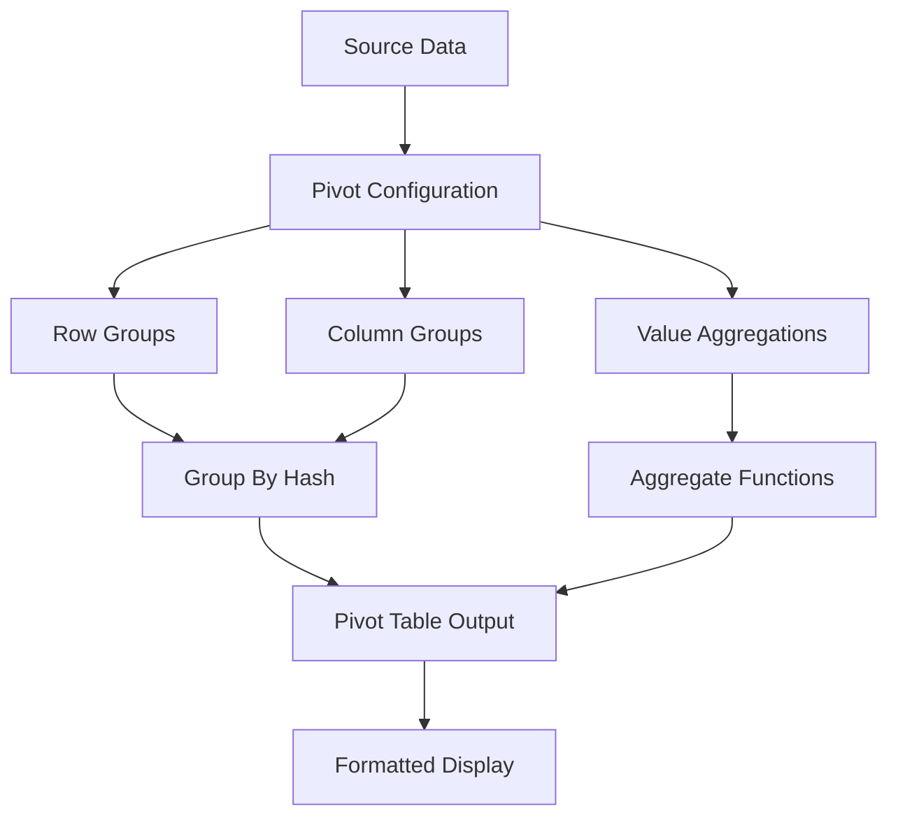

# Advanced Features Specification

## Overview

This specification covers advanced spreadsheet features including pivot tables, conditional formatting, data validation, charts, named ranges, and find/replace functionality.

## Pivot Tables

Pivot tables allow users to summarize and analyze large datasets through dynamic grouping and aggregation.

### Architecture



### Implementation

```rust
// rusheet-core/src/features/pivot.rs

use std::collections::{HashMap, HashSet};
use serde::{Serialize, Deserialize};

#[derive(Debug, Clone, Serialize, Deserialize)]
pub enum AggregateFunction {
    Sum,
    Average,
    Count,
    Min,
    Max,
    Product,
    StdDev,
    Variance,
}

#[derive(Debug, Clone, Serialize, Deserialize)]
pub struct PivotField {
    pub source_column: usize,
    pub name: String,
}

#[derive(Debug, Clone, Serialize, Deserialize)]
pub struct PivotValueField {
    pub source_column: usize,
    pub name: String,
    pub aggregate: AggregateFunction,
}

#[derive(Debug, Clone, Serialize, Deserialize)]
pub struct PivotTableConfig {
    pub source_range: SelectionRange,
    pub row_fields: Vec<PivotField>,
    pub column_fields: Vec<PivotField>,
    pub value_fields: Vec<PivotValueField>,
    pub filter_fields: Vec<PivotField>,
}

#[derive(Debug, Clone, PartialEq, Eq, Hash)]
struct GroupKey {
    values: Vec<String>,
}

pub struct PivotTable {
    config: PivotTableConfig,
    data: HashMap<GroupKey, HashMap<GroupKey, Vec<f64>>>,
}

impl PivotTable {
    pub fn new(config: PivotTableConfig) -> Self {
        Self {
            config,
            data: HashMap::new(),
        }
    }

    /// Build pivot table from source data
    pub fn build(&mut self, sheet: &Sheet) -> Result<(), String> {
        self.data.clear();

        let range = &self.config.source_range;

        // Iterate through source data
        for row in range.start_row..=range.end_row {
            // Extract row group key
            let row_key = self.extract_group_key(sheet, row, &self.config.row_fields);

            // Extract column group key
            let col_key = self.extract_group_key(sheet, row, &self.config.column_fields);

            // Extract values
            let values = self.extract_values(sheet, row);

            // Store in hash map
            self.data
                .entry(row_key)
                .or_insert_with(HashMap::new)
                .entry(col_key)
                .or_insert_with(Vec::new)
                .extend(values);
        }

        Ok(())
    }

    fn extract_group_key(&self, sheet: &Sheet, row: usize, fields: &[PivotField]) -> GroupKey {
        let values = fields
            .iter()
            .map(|field| {
                sheet
                    .get_cell(row, field.source_column)
                    .map(|cell| cell.display_value.clone())
                    .unwrap_or_default()
            })
            .collect();

        GroupKey { values }
    }

    fn extract_values(&self, sheet: &Sheet, row: usize) -> Vec<f64> {
        self.config
            .value_fields
            .iter()
            .filter_map(|field| {
                sheet
                    .get_cell(row, field.source_column)
                    .and_then(|cell| cell.display_value.parse::<f64>().ok())
            })
            .collect()
    }

    /// Calculate aggregated result for a specific cell
    pub fn get_aggregated_value(
        &self,
        row_key: &GroupKey,
        col_key: &GroupKey,
        value_field_idx: usize,
    ) -> Option<f64> {
        let values = self.data.get(row_key)?.get(col_key)?;

        if values.is_empty() {
            return None;
        }

        let value_field = &self.config.value_fields[value_field_idx];

        Some(match value_field.aggregate {
            AggregateFunction::Sum => values.iter().sum(),
            AggregateFunction::Average => values.iter().sum::<f64>() / values.len() as f64,
            AggregateFunction::Count => values.len() as f64,
            AggregateFunction::Min => values.iter().copied().fold(f64::INFINITY, f64::min),
            AggregateFunction::Max => values.iter().copied().fold(f64::NEG_INFINITY, f64::max),
            AggregateFunction::Product => values.iter().product(),
            AggregateFunction::StdDev => self.calculate_stddev(values),
            AggregateFunction::Variance => self.calculate_variance(values),
        })
    }

    fn calculate_variance(&self, values: &[f64]) -> f64 {
        if values.is_empty() {
            return 0.0;
        }

        let mean = values.iter().sum::<f64>() / values.len() as f64;
        let variance = values
            .iter()
            .map(|v| (v - mean).powi(2))
            .sum::<f64>() / values.len() as f64;

        variance
    }

    fn calculate_stddev(&self, values: &[f64]) -> f64 {
        self.calculate_variance(values).sqrt()
    }

    /// Get all unique row group keys
    pub fn get_row_keys(&self) -> Vec<&GroupKey> {
        self.data.keys().collect()
    }

    /// Get all unique column group keys
    pub fn get_column_keys(&self) -> HashSet<&GroupKey> {
        self.data
            .values()
            .flat_map(|cols| cols.keys())
            .collect()
    }
}
```

## Conditional Formatting

Visual formatting rules applied to cells based on their values.

```rust
// rusheet-core/src/features/conditional_format.rs

use serde::{Serialize, Deserialize};

#[derive(Debug, Clone, Serialize, Deserialize)]
pub enum FormatRule {
    /// Cell value comparison
    CellValue {
        operator: ComparisonOperator,
        value: String,
        format: CellFormat,
    },

    /// Color scales (2 or 3 color gradients)
    ColorScale {
        min_color: String,
        mid_color: Option<String>,
        max_color: String,
    },

    /// Data bars
    DataBar {
        color: String,
        show_value: bool,
        min_value: Option<f64>,
        max_value: Option<f64>,
    },

    /// Icon sets
    IconSet {
        icon_type: IconSetType,
        reverse_order: bool,
    },

    /// Formula-based
    Formula {
        formula: String,
        format: CellFormat,
    },

    /// Top/Bottom N values
    TopBottom {
        top: bool,
        count: usize,
        format: CellFormat,
    },

    /// Above/Below average
    Average {
        above: bool,
        format: CellFormat,
    },

    /// Duplicate values
    Duplicates {
        unique: bool,
        format: CellFormat,
    },
}

#[derive(Debug, Clone, Copy, Serialize, Deserialize)]
pub enum ComparisonOperator {
    Equal,
    NotEqual,
    GreaterThan,
    GreaterThanOrEqual,
    LessThan,
    LessThanOrEqual,
    Between,
    NotBetween,
}

#[derive(Debug, Clone, Serialize, Deserialize)]
pub enum IconSetType {
    Arrows3,
    Arrows5,
    Flags3,
    Traffic3,
    Stars5,
    Ratings4,
}

#[derive(Debug, Clone, Serialize, Deserialize)]
pub struct CellFormat {
    pub background_color: Option<String>,
    pub text_color: Option<String>,
    pub bold: Option<bool>,
    pub italic: Option<bool>,
    pub underline: Option<bool>,
}

#[derive(Debug, Clone, Serialize, Deserialize)]
pub struct ConditionalFormat {
    pub id: String,
    pub range: SelectionRange,
    pub rule: FormatRule,
    pub priority: i32,
    pub stop_if_true: bool,
}

pub struct ConditionalFormatEngine {
    formats: Vec<ConditionalFormat>,
}

impl ConditionalFormatEngine {
    pub fn new() -> Self {
        Self {
            formats: Vec::new(),
        }
    }

    pub fn add_format(&mut self, format: ConditionalFormat) {
        self.formats.push(format);
        self.formats.sort_by_key(|f| f.priority);
    }

    pub fn remove_format(&mut self, id: &str) {
        self.formats.retain(|f| f.id != id);
    }

    /// Get effective format for a cell
    pub fn get_format(&self, row: usize, col: usize, sheet: &Sheet) -> Option<CellFormat> {
        for format in &self.formats {
            if !format.range.contains(row, col) {
                continue;
            }

            if let Some(cell_format) = self.evaluate_rule(&format.rule, row, col, sheet) {
                if format.stop_if_true {
                    return Some(cell_format);
                }
            }
        }

        None
    }

    fn evaluate_rule(
        &self,
        rule: &FormatRule,
        row: usize,
        col: usize,
        sheet: &Sheet,
    ) -> Option<CellFormat> {
        match rule {
            FormatRule::CellValue { operator, value, format } => {
                let cell = sheet.get_cell(row, col)?;
                if self.compare_value(&cell.display_value, operator, value) {
                    Some(format.clone())
                } else {
                    None
                }
            }

            FormatRule::ColorScale { min_color, mid_color, max_color } => {
                let cell = sheet.get_cell(row, col)?;
                let value = cell.display_value.parse::<f64>().ok()?;

                // Calculate color based on value position in range
                let color = self.interpolate_color(value, min_color, mid_color.as_ref(), max_color)?;

                Some(CellFormat {
                    background_color: Some(color),
                    text_color: None,
                    bold: None,
                    italic: None,
                    underline: None,
                })
            }

            FormatRule::DataBar { color, show_value, min_value, max_value } => {
                // Data bars are rendered specially in the renderer
                None
            }

            FormatRule::Formula { formula, format } => {
                // Evaluate formula in context of this cell
                // If true, apply format
                None // TODO: Implement formula evaluation
            }

            _ => None, // Other rules...
        }
    }

    fn compare_value(&self, cell_value: &str, operator: &ComparisonOperator, compare_to: &str) -> bool {
        // Try numeric comparison first
        if let (Ok(a), Ok(b)) = (cell_value.parse::<f64>(), compare_to.parse::<f64>()) {
            use ComparisonOperator::*;
            match operator {
                Equal => (a - b).abs() < f64::EPSILON,
                NotEqual => (a - b).abs() >= f64::EPSILON,
                GreaterThan => a > b,
                GreaterThanOrEqual => a >= b,
                LessThan => a < b,
                LessThanOrEqual => a <= b,
                _ => false,
            }
        } else {
            // String comparison
            use ComparisonOperator::*;
            match operator {
                Equal => cell_value == compare_to,
                NotEqual => cell_value != compare_to,
                _ => false,
            }
        }
    }

    fn interpolate_color(
        &self,
        value: f64,
        min_color: &str,
        mid_color: Option<&String>,
        max_color: &str,
    ) -> Option<String> {
        // TODO: Implement color interpolation
        Some(min_color.to_string())
    }
}
```

## Data Validation

Restrict cell input to specific types or ranges of values.

```rust
// rusheet-core/src/features/validation.rs

use serde::{Serialize, Deserialize};

#[derive(Debug, Clone, Serialize, Deserialize)]
pub enum ValidationRule {
    /// Allow only whole numbers
    WholeNumber {
        operator: ComparisonOperator,
        value: i64,
        value2: Option<i64>,
    },

    /// Allow only decimal numbers
    Decimal {
        operator: ComparisonOperator,
        value: f64,
        value2: Option<f64>,
    },

    /// List of allowed values
    List {
        values: Vec<String>,
        dropdown: bool,
    },

    /// Date constraints
    Date {
        operator: ComparisonOperator,
        date: String,
        date2: Option<String>,
    },

    /// Text length
    TextLength {
        operator: ComparisonOperator,
        length: usize,
        length2: Option<usize>,
    },

    /// Custom formula
    Custom {
        formula: String,
    },
}

#[derive(Debug, Clone, Serialize, Deserialize)]
pub struct DataValidation {
    pub id: String,
    pub range: SelectionRange,
    pub rule: ValidationRule,
    pub show_dropdown: bool,
    pub show_error: bool,
    pub error_title: String,
    pub error_message: String,
    pub show_input_message: bool,
    pub input_title: String,
    pub input_message: String,
}

pub struct DataValidationEngine {
    validations: Vec<DataValidation>,
}

impl DataValidationEngine {
    pub fn new() -> Self {
        Self {
            validations: Vec::new(),
        }
    }

    pub fn add_validation(&mut self, validation: DataValidation) {
        self.validations.push(validation);
    }

    pub fn remove_validation(&mut self, id: &str) {
        self.validations.retain(|v| v.id != id);
    }

    pub fn get_validation(&self, row: usize, col: usize) -> Option<&DataValidation> {
        self.validations
            .iter()
            .find(|v| v.range.contains(row, col))
    }

    pub fn validate(&self, row: usize, col: usize, value: &str) -> Result<(), String> {
        if let Some(validation) = self.get_validation(row, col) {
            match &validation.rule {
                ValidationRule::WholeNumber { operator, value: val, value2 } => {
                    let num = value.parse::<i64>()
                        .map_err(|_| "Please enter a whole number".to_string())?;

                    self.validate_numeric(num as f64, *val as f64, value2.map(|v| v as f64), operator)
                        .map_err(|_| validation.error_message.clone())?;
                }

                ValidationRule::Decimal { operator, value: val, value2 } => {
                    let num = value.parse::<f64>()
                        .map_err(|_| "Please enter a decimal number".to_string())?;

                    self.validate_numeric(num, *val, *value2, operator)
                        .map_err(|_| validation.error_message.clone())?;
                }

                ValidationRule::List { values, .. } => {
                    if !values.contains(&value.to_string()) {
                        return Err(format!("Value must be one of: {}", values.join(", ")));
                    }
                }

                ValidationRule::TextLength { operator, length, length2 } => {
                    let len = value.len();
                    self.validate_numeric(len as f64, *length as f64, length2.map(|l| l as f64), operator)
                        .map_err(|_| validation.error_message.clone())?;
                }

                _ => {} // Other validation types
            }
        }

        Ok(())
    }

    fn validate_numeric(
        &self,
        value: f64,
        compare: f64,
        compare2: Option<f64>,
        operator: &ComparisonOperator,
    ) -> Result<(), ()> {
        use ComparisonOperator::*;

        let valid = match operator {
            Equal => (value - compare).abs() < f64::EPSILON,
            NotEqual => (value - compare).abs() >= f64::EPSILON,
            GreaterThan => value > compare,
            GreaterThanOrEqual => value >= compare,
            LessThan => value < compare,
            LessThanOrEqual => value <= compare,
            Between => {
                if let Some(max) = compare2 {
                    value >= compare && value <= max
                } else {
                    false
                }
            }
            NotBetween => {
                if let Some(max) = compare2 {
                    value < compare || value > max
                } else {
                    false
                }
            }
        };

        if valid {
            Ok(())
        } else {
            Err(())
        }
    }
}
```

## Named Ranges

Allow cells and ranges to be referenced by name instead of coordinates.

```rust
// rusheet-core/src/features/named_ranges.rs

use std::collections::HashMap;
use serde::{Serialize, Deserialize};

#[derive(Debug, Clone, Serialize, Deserialize)]
pub enum NamedRangeScope {
    Workbook,
    Sheet(String),
}

#[derive(Debug, Clone, Serialize, Deserialize)]
pub struct NamedRange {
    pub name: String,
    pub range: SelectionRange,
    pub sheet_id: Option<String>,
    pub scope: NamedRangeScope,
    pub comment: Option<String>,
}

pub struct NamedRangeManager {
    ranges: HashMap<String, NamedRange>,
}

impl NamedRangeManager {
    pub fn new() -> Self {
        Self {
            ranges: HashMap::new(),
        }
    }

    pub fn add(&mut self, range: NamedRange) -> Result<(), String> {
        // Validate name
        if !Self::is_valid_name(&range.name) {
            return Err(format!("Invalid name: {}", range.name));
        }

        // Check for duplicates in same scope
        if self.ranges.contains_key(&range.name) {
            return Err(format!("Name already exists: {}", range.name));
        }

        self.ranges.insert(range.name.clone(), range);
        Ok(())
    }

    pub fn remove(&mut self, name: &str) {
        self.ranges.remove(name);
    }

    pub fn get(&self, name: &str) -> Option<&NamedRange> {
        self.ranges.get(name)
    }

    pub fn rename(&mut self, old_name: &str, new_name: &str) -> Result<(), String> {
        if !Self::is_valid_name(new_name) {
            return Err(format!("Invalid name: {}", new_name));
        }

        if let Some(mut range) = self.ranges.remove(old_name) {
            range.name = new_name.to_string();
            self.ranges.insert(new_name.to_string(), range);
            Ok(())
        } else {
            Err(format!("Name not found: {}", old_name))
        }
    }

    pub fn list_all(&self) -> Vec<&NamedRange> {
        self.ranges.values().collect()
    }

    fn is_valid_name(name: &str) -> bool {
        if name.is_empty() || name.len() > 255 {
            return false;
        }

        // Must start with letter or underscore
        let first = name.chars().next().unwrap();
        if !first.is_alphabetic() && first != '_' {
            return false;
        }

        // Can only contain letters, numbers, underscores
        name.chars().all(|c| c.is_alphanumeric() || c == '_')
    }
}
```

## Find and Replace

Search for cell content and optionally replace it.

```rust
// rusheet-core/src/features/find_replace.rs

use regex::Regex;

#[derive(Debug, Clone)]
pub struct FindOptions {
    pub match_case: bool,
    pub match_entire_cell: bool,
    pub search_formulas: bool,
    pub search_values: bool,
    pub use_regex: bool,
}

impl Default for FindOptions {
    fn default() -> Self {
        Self {
            match_case: false,
            match_entire_cell: false,
            search_formulas: false,
            search_values: true,
            use_regex: false,
        }
    }
}

#[derive(Debug, Clone, Copy)]
pub struct FindResult {
    pub row: usize,
    pub col: usize,
    pub start_index: usize,
    pub end_index: usize,
}

pub struct FindEngine {
    options: FindOptions,
    last_result: Option<FindResult>,
}

impl FindEngine {
    pub fn new(options: FindOptions) -> Self {
        Self {
            options,
            last_result: None,
        }
    }

    pub fn find_all(&self, sheet: &Sheet, pattern: &str) -> Vec<FindResult> {
        let mut results = Vec::new();

        let range = SelectionRange::new(0, 0, sheet.row_count - 1, sheet.col_count - 1);

        for cell_pos in range.iter_cells() {
            if let Some(cell) = sheet.get_cell(cell_pos.row, cell_pos.col) {
                let text = if self.options.search_formulas {
                    if let CellValue::Formula(f) = &cell.value {
                        f
                    } else {
                        &cell.display_value
                    }
                } else {
                    &cell.display_value
                };

                if let Some(matches) = self.find_in_text(text, pattern) {
                    for (start, end) in matches {
                        results.push(FindResult {
                            row: cell_pos.row,
                            col: cell_pos.col,
                            start_index: start,
                            end_index: end,
                        });
                    }
                }
            }
        }

        results
    }

    pub fn find_next(&mut self, sheet: &Sheet, pattern: &str) -> Option<FindResult> {
        let start_pos = self.last_result.map(|r| (r.row, r.col)).unwrap_or((0, 0));

        // Search from start_pos onwards
        for row in start_pos.0..sheet.row_count {
            let start_col = if row == start_pos.0 { start_pos.1 + 1 } else { 0 };

            for col in start_col..sheet.col_count {
                if let Some(result) = self.find_at(sheet, pattern, row, col) {
                    self.last_result = Some(result);
                    return Some(result);
                }
            }
        }

        // Wrap around to beginning
        for row in 0..=start_pos.0 {
            let end_col = if row == start_pos.0 { start_pos.1 } else { sheet.col_count };

            for col in 0..end_col {
                if let Some(result) = self.find_at(sheet, pattern, row, col) {
                    self.last_result = Some(result);
                    return Some(result);
                }
            }
        }

        None
    }

    fn find_at(&self, sheet: &Sheet, pattern: &str, row: usize, col: usize) -> Option<FindResult> {
        let cell = sheet.get_cell(row, col)?;

        let text = if self.options.search_formulas {
            if let CellValue::Formula(f) = &cell.value {
                f
            } else {
                &cell.display_value
            }
        } else {
            &cell.display_value
        };

        if let Some(matches) = self.find_in_text(text, pattern) {
            if let Some((start, end)) = matches.first() {
                return Some(FindResult {
                    row,
                    col,
                    start_index: *start,
                    end_index: *end,
                });
            }
        }

        None
    }

    fn find_in_text(&self, text: &str, pattern: &str) -> Option<Vec<(usize, usize)>> {
        if self.options.use_regex {
            let regex = Regex::new(pattern).ok()?;
            let matches: Vec<_> = regex
                .find_iter(text)
                .map(|m| (m.start(), m.end()))
                .collect();

            if matches.is_empty() {
                None
            } else {
                Some(matches)
            }
        } else {
            let search_text = if self.options.match_case {
                text.to_string()
            } else {
                text.to_lowercase()
            };

            let search_pattern = if self.options.match_case {
                pattern.to_string()
            } else {
                pattern.to_lowercase()
            };

            if self.options.match_entire_cell {
                if search_text == search_pattern {
                    Some(vec![(0, text.len())])
                } else {
                    None
                }
            } else {
                let matches: Vec<_> = search_text
                    .match_indices(&search_pattern)
                    .map(|(start, _)| (start, start + search_pattern.len()))
                    .collect();

                if matches.is_empty() {
                    None
                } else {
                    Some(matches)
                }
            }
        }
    }

    pub fn replace_all(&self, sheet: &mut Sheet, pattern: &str, replacement: &str) -> usize {
        let results = self.find_all(sheet, pattern);
        let mut count = 0;

        for result in results {
            if let Some(cell) = sheet.get_cell_mut(result.row, result.col) {
                let new_value = if self.options.search_formulas {
                    if let CellValue::Formula(f) = &cell.value {
                        f.replace(pattern, replacement)
                    } else {
                        cell.display_value.replace(pattern, replacement)
                    }
                } else {
                    cell.display_value.replace(pattern, replacement)
                };

                cell.value = CellValue::String(new_value.clone());
                cell.display_value = new_value;
                count += 1;
            }
        }

        count
    }
}
```

## Charts (Data Structure)

Chart rendering would be handled by the frontend, but we define the data structure:

```rust
// rusheet-core/src/features/charts.rs

use serde::{Serialize, Deserialize};

#[derive(Debug, Clone, Serialize, Deserialize)]
pub enum ChartType {
    Line,
    Bar,
    Column,
    Pie,
    Scatter,
    Area,
    Radar,
}

#[derive(Debug, Clone, Serialize, Deserialize)]
pub struct ChartSeries {
    pub name: String,
    pub data_range: SelectionRange,
    pub color: Option<String>,
}

#[derive(Debug, Clone, Serialize, Deserialize)]
pub struct ChartConfig {
    pub id: String,
    pub chart_type: ChartType,
    pub title: String,
    pub x_axis_label: String,
    pub y_axis_label: String,
    pub x_axis_range: Option<SelectionRange>,
    pub series: Vec<ChartSeries>,
    pub show_legend: bool,
    pub show_grid: bool,
    pub width: f64,
    pub height: f64,
    pub position: CellPosition,
}

impl ChartConfig {
    pub fn new(chart_type: ChartType, title: String) -> Self {
        Self {
            id: uuid::Uuid::new_v4().to_string(),
            chart_type,
            title,
            x_axis_label: String::new(),
            y_axis_label: String::new(),
            x_axis_range: None,
            series: Vec::new(),
            show_legend: true,
            show_grid: true,
            width: 400.0,
            height: 300.0,
            position: CellPosition::new(0, 0),
        }
    }

    pub fn add_series(&mut self, series: ChartSeries) {
        self.series.push(series);
    }

    /// Extract data for rendering
    pub fn get_data(&self, sheet: &Sheet) -> ChartData {
        let mut x_labels = Vec::new();
        let mut series_data = Vec::new();

        // Extract x-axis labels
        if let Some(x_range) = &self.x_axis_range {
            for cell_pos in x_range.iter_cells() {
                if let Some(cell) = sheet.get_cell(cell_pos.row, cell_pos.col) {
                    x_labels.push(cell.display_value.clone());
                }
            }
        }

        // Extract series data
        for series in &self.series {
            let mut values = Vec::new();

            for cell_pos in series.data_range.iter_cells() {
                if let Some(cell) = sheet.get_cell(cell_pos.row, cell_pos.col) {
                    if let Ok(num) = cell.display_value.parse::<f64>() {
                        values.push(num);
                    }
                }
            }

            series_data.push(SeriesData {
                name: series.name.clone(),
                values,
                color: series.color.clone(),
            });
        }

        ChartData {
            x_labels,
            series: series_data,
        }
    }
}

#[derive(Debug, Clone, Serialize, Deserialize)]
pub struct ChartData {
    pub x_labels: Vec<String>,
    pub series: Vec<SeriesData>,
}

#[derive(Debug, Clone, Serialize, Deserialize)]
pub struct SeriesData {
    pub name: String,
    pub values: Vec<f64>,
    pub color: Option<String>,
}
```

## TypeScript Integration

```typescript
// frontend/src/features/advanced-features.ts

export interface PivotTableConfig {
  sourceRange: SelectionRange;
  rowFields: PivotField[];
  columnFields: PivotField[];
  valueFields: PivotValueField[];
}

export interface ConditionalFormatRule {
  type: 'cellValue' | 'colorScale' | 'dataBar' | 'iconSet' | 'formula';
  config: any;
  format?: CellFormat;
}

export class AdvancedFeaturesManager {
  constructor(private wasmModule: any) {}

  createPivotTable(config: PivotTableConfig): void {
    this.wasmModule.create_pivot_table(JSON.stringify(config));
  }

  addConditionalFormat(range: SelectionRange, rule: ConditionalFormatRule): void {
    this.wasmModule.add_conditional_format(
      JSON.stringify(range),
      JSON.stringify(rule)
    );
  }

  addDataValidation(range: SelectionRange, validation: any): void {
    this.wasmModule.add_data_validation(
      JSON.stringify(range),
      JSON.stringify(validation)
    );
  }

  createChart(config: ChartConfig): string {
    return this.wasmModule.create_chart(JSON.stringify(config));
  }

  find(pattern: string, options: FindOptions): FindResult[] {
    const resultsJson = this.wasmModule.find_all(pattern, JSON.stringify(options));
    return JSON.parse(resultsJson);
  }

  replaceAll(pattern: string, replacement: string): number {
    return this.wasmModule.replace_all(pattern, replacement);
  }
}
```

## References

- [Excel Pivot Tables](https://support.microsoft.com/en-us/office/create-a-pivottable-to-analyze-worksheet-data-a9a84538-bfe9-40a9-a8e9-f99134456576)
- [Conditional Formatting](https://support.microsoft.com/en-us/office/use-conditional-formatting-to-highlight-information-fed60dfa-1d3f-4e13-9ecb-f1951ff89d7f)
- [Data Validation](https://support.microsoft.com/en-us/office/apply-data-validation-to-cells-29fecbcc-d1b9-42c1-9d76-eff3ce5f7249)
- [Named Ranges](https://support.microsoft.com/en-us/office/define-and-use-names-in-formulas-4d0f13ac-53b7-422e-afd2-abd7ff379c64)
