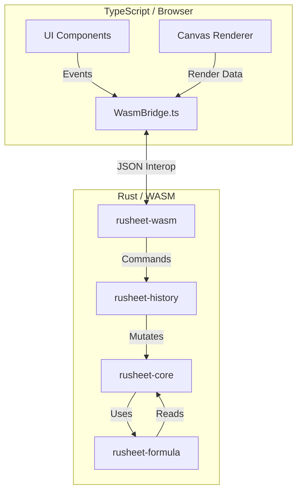

# Rusheet Architecture

Rusheet follows a **Layered Architecture** designed to separate presentation (TypeScript/Canvas) from logic (Rust/WASM). The system is composed of a high-performance Rust core compiled to WebAssembly, communicating with a TypeScript frontend.

## High-Level Diagram

## Component Breakdown

### 1. Frontend (TypeScript)
*   **Path**: `src/`
*   **Responsibilities**:
    *   Handling user input (keyboard, mouse).
    *   Rendering the grid using HTML Canvas for performance.
    *   Managing the React application state.
    *   **`core/WasmBridge.ts`**: The strict boundary layer. It handles lazy loading of the WASM module and marshals data between JS objects and JSON strings required by the Rust backend.

### 2. WASM Facade (rusheet-wasm)
*   **Path**: `crates/rusheet-wasm`
*   **Responsibilities**:
    *   Exposes a high-level API class `SpreadsheetEngine` to JavaScript.
    *   Handles JSON serialization/deserialization of Rust structs.
    *   **Controller Role**: Orchestrates the interaction between `History`, `Core`, and `Formula`. It explicitly handles the "Update -> Recalculate" loop, as `Core` is a passive data store.

### 3. History Management (rusheet-history)
*   **Path**: `crates/rusheet-history`
*   **Responsibilities**:
    *   Implements the **Command Pattern**.
    *   Manages the `HistoryManager` stack for Undo/Redo operations.
    *   Defines atomic commands like `SetCellValueCommand`, `SetCellFormatCommand`.
    *   Ensures all state mutations are reversible.

### 4. Core Logic (rusheet-core)
*   **Path**: `crates/rusheet-core`
*   **Responsibilities**:
    *   Defines the primary data models: `Workbook`, `Sheet`, `Cell`, `CellContent`.
    *   Manages structural operations: adding/removing sheets, resizing rows/cols.
    *   Stores cell formatting and metadata.
    *   Provides raw access to cell data for the formula engine.

### 5. Formula Engine (rusheet-formula)
*   **Path**: `crates/rusheet-formula`
*   **Responsibilities**:
    *   **Lexer & Parser**: Converts string formulas (e.g., `=SUM(A1:B2)`) into an AST.
    *   **Evaluator**: Executes the AST against the `Workbook` data.
    *   **Dependency Graph**: Tracks cell dependencies to efficiently determine which cells need recalculation when a value changes.

## Data Flow Principles
1.  **Unidirectional Updates**: The UI never modifies the core state directly. It requests changes via the `WasmBridge`.
2.  **Command-Based Mutation**: All changes go through the `History` system to guarantee undo capability.
3.  **Lazy Evaluation**: Formulas are parsed and stored, but typically re-evaluated only when dependencies change (triggered by the `DependencyGraph`).

---

## Detailed Specifications

For in-depth technical specifications, see the following documents:

### Core Architecture
- **[FSM Specification](./fsm.md)** - Cell lifecycle and history stack state machines
- **[Data Flow](./flowchart.md)** - Critical data flow diagrams and sequence charts

### Rendering & Performance
- **[Rendering Engine](./rendering-engine.md)** - Canvas/DOM hybrid model, virtual scrolling, spatial indexing
- **[Performance](./performance.md)** - 60 FPS targets, optimization strategies, profiling techniques

### Data Layer
- **[Data Structures](./data-structures.md)** - Sparse matrix storage, gap buffers, CRDT integration
- **[Formula Engine](./formula-engine.md)** - AST parsing, dependency graph, topological sort

### User Experience
- **[User Experience](./user-experience.md)** - Selection model, fill handle, navigation, undo/redo
- **[Keyboard Shortcuts](./keyboard-shortcuts.md)** - Complete shortcut reference and implementation

### Advanced Features
- **[Advanced Features](./advanced-features.md)** - Pivot tables, conditional formatting, charts
- **[WASM Integration](./wasm-integration.md)** - JS/Rust bridge, shared memory, serialization
