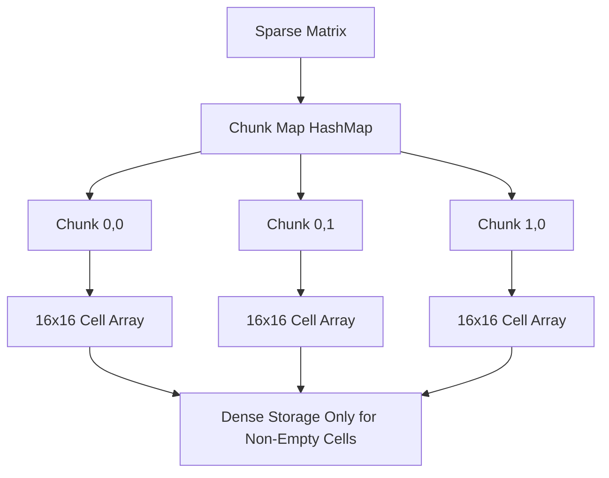

# Data Structures Specification

## Overview

RuSheet uses specialized data structures optimized for sparse spreadsheet data, efficient insertion/deletion, and real-time collaboration. The core principle is to minimize memory usage while maintaining fast access times for common operations.

## Sparse Matrix Storage

Spreadsheets are inherently sparse - most cells are empty. We use a hybrid approach combining HashMap/BTreeMap with chunked storage for locality.

### Architecture



### Implementation

```rust
// rusheet-core/src/data/sparse_matrix.rs

use std::collections::HashMap;
use serde::{Serialize, Deserialize};

const CHUNK_SIZE: usize = 16;

#[derive(Debug, Clone, Copy, PartialEq, Eq, Hash)]
pub struct ChunkCoord {
    pub chunk_row: usize,
    pub chunk_col: usize,
}

impl ChunkCoord {
    pub fn from_cell(row: usize, col: usize) -> Self {
        Self {
            chunk_row: row / CHUNK_SIZE,
            chunk_col: col / CHUNK_SIZE,
        }
    }
}

#[derive(Debug, Clone, Copy, PartialEq, Eq, Hash)]
pub struct CellCoord {
    pub row: usize,
    pub col: usize,
}

impl CellCoord {
    pub fn new(row: usize, col: usize) -> Self {
        Self { row, col }
    }

    pub fn chunk_coord(&self) -> ChunkCoord {
        ChunkCoord::from_cell(self.row, self.col)
    }

    pub fn local_coord(&self) -> (usize, usize) {
        (self.row % CHUNK_SIZE, self.col % CHUNK_SIZE)
    }
}

#[derive(Debug, Clone, Serialize, Deserialize)]
pub struct Chunk<T> {
    // Only store non-empty cells
    cells: HashMap<(usize, usize), T>,
    // Track which cells have been explicitly set to empty
    cleared_cells: std::collections::HashSet<(usize, usize)>,
}

impl<T> Chunk<T> {
    pub fn new() -> Self {
        Self {
            cells: HashMap::new(),
            cleared_cells: std::collections::HashSet::new(),
        }
    }

    pub fn get(&self, local_row: usize, local_col: usize) -> Option<&T> {
        self.cells.get(&(local_row, local_col))
    }

    pub fn insert(&mut self, local_row: usize, local_col: usize, value: T) {
        self.cells.insert((local_row, local_col), value);
        self.cleared_cells.remove(&(local_row, local_col));
    }

    pub fn remove(&mut self, local_row: usize, local_col: usize) -> Option<T> {
        self.cleared_cells.insert((local_row, local_col));
        self.cells.remove(&(local_row, local_col))
    }

    pub fn is_empty(&self) -> bool {
        self.cells.is_empty()
    }

    pub fn len(&self) -> usize {
        self.cells.len()
    }
}

#[derive(Debug, Clone, Serialize, Deserialize)]
pub struct SparseMatrix<T> {
    chunks: HashMap<ChunkCoord, Chunk<T>>,
    // Cache for faster column-width and row-height lookups
    custom_row_heights: HashMap<usize, f64>,
    custom_col_widths: HashMap<usize, f64>,
}

impl<T: Clone> SparseMatrix<T> {
    pub fn new() -> Self {
        Self {
            chunks: HashMap::new(),
            custom_row_heights: HashMap::new(),
            custom_col_widths: HashMap::new(),
        }
    }

    pub fn get(&self, row: usize, col: usize) -> Option<&T> {
        let coord = CellCoord::new(row, col);
        let chunk_coord = coord.chunk_coord();
        let (local_row, local_col) = coord.local_coord();

        self.chunks
            .get(&chunk_coord)
            .and_then(|chunk| chunk.get(local_row, local_col))
    }

    pub fn insert(&mut self, row: usize, col: usize, value: T) {
        let coord = CellCoord::new(row, col);
        let chunk_coord = coord.chunk_coord();
        let (local_row, local_col) = coord.local_coord();

        let chunk = self.chunks.entry(chunk_coord).or_insert_with(Chunk::new);
        chunk.insert(local_row, local_col, value);
    }

    pub fn remove(&mut self, row: usize, col: usize) -> Option<T> {
        let coord = CellCoord::new(row, col);
        let chunk_coord = coord.chunk_coord();
        let (local_row, local_col) = coord.local_coord();

        if let Some(chunk) = self.chunks.get_mut(&chunk_coord) {
            let result = chunk.remove(local_row, local_col);

            // Clean up empty chunks
            if chunk.is_empty() {
                self.chunks.remove(&chunk_coord);
            }

            result
        } else {
            None
        }
    }

    /// Get all cells in a range
    pub fn get_range(&self, start_row: usize, end_row: usize,
                     start_col: usize, end_col: usize) -> Vec<(usize, usize, &T)> {
        let mut result = Vec::new();

        let start_chunk = ChunkCoord::from_cell(start_row, start_col);
        let end_chunk = ChunkCoord::from_cell(end_row, end_col);

        for chunk_row in start_chunk.chunk_row..=end_chunk.chunk_row {
            for chunk_col in start_chunk.chunk_col..=end_chunk.chunk_col {
                let chunk_coord = ChunkCoord { chunk_row, chunk_col };

                if let Some(chunk) = self.chunks.get(&chunk_coord) {
                    for ((local_row, local_col), value) in &chunk.cells {
                        let row = chunk_row * CHUNK_SIZE + local_row;
                        let col = chunk_col * CHUNK_SIZE + local_col;

                        if row >= start_row && row <= end_row &&
                           col >= start_col && col <= end_col {
                            result.push((row, col, value));
                        }
                    }
                }
            }
        }

        result
    }

    /// Count non-empty cells
    pub fn cell_count(&self) -> usize {
        self.chunks.values().map(|chunk| chunk.len()).sum()
    }

    /// Memory usage estimation in bytes
    pub fn estimated_memory_usage(&self) -> usize {
        let chunk_overhead = std::mem::size_of::<ChunkCoord>() +
                            std::mem::size_of::<Chunk<T>>();
        let cell_overhead = std::mem::size_of::<(usize, usize)>() +
                           std::mem::size_of::<T>();

        self.chunks.len() * chunk_overhead +
        self.cell_count() * cell_overhead
    }
}

impl<T: Clone> Default for SparseMatrix<T> {
    fn default() -> Self {
        Self::new()
    }
}
```

## Gap Buffers for Row/Column Operations

Gap buffers provide O(log N) insertion and deletion for rows and columns, crucial for smooth user experience when inserting/deleting many rows.

```rust
// rusheet-core/src/data/gap_buffer.rs

use std::collections::BTreeMap;

/// Gap buffer for efficient row/column insertion and deletion
#[derive(Debug, Clone)]
pub struct GapBuffer {
    // Maps logical index to physical index
    // Gaps are represented by missing entries
    logical_to_physical: BTreeMap<usize, usize>,
    physical_to_logical: BTreeMap<usize, usize>,
    next_physical: usize,
    deleted_indices: Vec<usize>,
}

impl GapBuffer {
    pub fn new(initial_size: usize) -> Self {
        let mut buffer = Self {
            logical_to_physical: BTreeMap::new(),
            physical_to_logical: BTreeMap::new(),
            next_physical: initial_size,
            deleted_indices: Vec::new(),
        };

        // Initialize with identity mapping
        for i in 0..initial_size {
            buffer.logical_to_physical.insert(i, i);
            buffer.physical_to_logical.insert(i, i);
        }

        buffer
    }

    /// Insert count rows/columns at logical index
    pub fn insert(&mut self, logical_index: usize, count: usize) {
        // Shift all logical indices >= logical_index
        let to_shift: Vec<_> = self.logical_to_physical
            .range(logical_index..)
            .map(|(k, v)| (*k, *v))
            .collect();

        for (old_logical, physical) in to_shift {
            self.logical_to_physical.remove(&old_logical);
            self.logical_to_physical.insert(old_logical + count, physical);
            self.physical_to_logical.insert(physical, old_logical + count);
        }

        // Allocate physical indices for new rows
        for i in 0..count {
            let physical = if let Some(reused) = self.deleted_indices.pop() {
                reused
            } else {
                let p = self.next_physical;
                self.next_physical += 1;
                p
            };

            self.logical_to_physical.insert(logical_index + i, physical);
            self.physical_to_logical.insert(physical, logical_index + i);
        }
    }

    /// Delete count rows/columns starting at logical index
    pub fn delete(&mut self, logical_index: usize, count: usize) {
        // Remove the deleted range
        for i in 0..count {
            if let Some(physical) = self.logical_to_physical.remove(&(logical_index + i)) {
                self.physical_to_logical.remove(&physical);
                self.deleted_indices.push(physical);
            }
        }

        // Shift all logical indices > logical_index + count
        let to_shift: Vec<_> = self.logical_to_physical
            .range((logical_index + count)..)
            .map(|(k, v)| (*k, *v))
            .collect();

        for (old_logical, physical) in to_shift {
            self.logical_to_physical.remove(&old_logical);
            self.logical_to_physical.insert(old_logical - count, physical);
            self.physical_to_logical.insert(physical, old_logical - count);
        }
    }

    /// Get physical index from logical index
    pub fn get_physical(&self, logical: usize) -> Option<usize> {
        self.logical_to_physical.get(&logical).copied()
    }

    /// Get logical index from physical index
    pub fn get_logical(&self, physical: usize) -> Option<usize> {
        self.physical_to_logical.get(&physical).copied()
    }
}
```

## CRDT Integration

Support for Conflict-free Replicated Data Types (CRDTs) enables real-time collaboration. We integrate with Loro or Yjs for this functionality.

```rust
// rusheet-core/src/data/crdt_bridge.rs

use serde::{Serialize, Deserialize};

#[derive(Debug, Clone, Serialize, Deserialize)]
pub struct CellOperation {
    pub row: usize,
    pub col: usize,
    pub op_type: OperationType,
    pub timestamp: u64,
    pub actor_id: String,
}

#[derive(Debug, Clone, Serialize, Deserialize)]
pub enum OperationType {
    SetValue { value: String },
    SetFormula { formula: String },
    SetStyle { style: CellStyle },
    Clear,
}

#[derive(Debug, Clone, Serialize, Deserialize)]
pub struct CellStyle {
    pub font_size: Option<f64>,
    pub font_family: Option<String>,
    pub bold: Option<bool>,
    pub italic: Option<bool>,
    pub color: Option<String>,
    pub background_color: Option<String>,
}

/// CRDT-aware spreadsheet document
pub struct CrdtDocument {
    // Loro document handle (when using Loro)
    loro_doc: loro::LoroDoc,

    // Local cache of cell data
    local_cache: SparseMatrix<CellData>,
}

impl CrdtDocument {
    pub fn new() -> Self {
        Self {
            loro_doc: loro::LoroDoc::new(),
            local_cache: SparseMatrix::new(),
        }
    }

    /// Apply a local operation and broadcast to peers
    pub fn apply_local_op(&mut self, op: CellOperation) -> Result<(), String> {
        // Apply to Loro document
        let cell_key = format!("cell_{}_{}", op.row, op.col);

        match op.op_type {
            OperationType::SetValue { ref value } => {
                self.loro_doc.get_map("cells")
                    .insert(&cell_key, value.clone())?;
            }
            OperationType::SetFormula { ref formula } => {
                self.loro_doc.get_map("formulas")
                    .insert(&cell_key, formula.clone())?;
            }
            OperationType::SetStyle { ref style } => {
                let style_json = serde_json::to_string(style)
                    .map_err(|e| e.to_string())?;
                self.loro_doc.get_map("styles")
                    .insert(&cell_key, style_json)?;
            }
            OperationType::Clear => {
                self.loro_doc.get_map("cells").delete(&cell_key)?;
                self.loro_doc.get_map("formulas").delete(&cell_key)?;
                self.loro_doc.get_map("styles").delete(&cell_key)?;
            }
        }

        // Update local cache
        self.update_local_cache(&op);

        Ok(())
    }

    /// Apply remote operation received from peer
    pub fn apply_remote_op(&mut self, encoded_op: &[u8]) -> Result<(), String> {
        // Decode and apply Loro operation
        self.loro_doc.import(encoded_op)?;

        // Sync local cache
        self.sync_local_cache();

        Ok(())
    }

    /// Export document state for transmission
    pub fn export_snapshot(&self) -> Vec<u8> {
        self.loro_doc.export_snapshot()
    }

    /// Import document state from snapshot
    pub fn import_snapshot(&mut self, snapshot: &[u8]) -> Result<(), String> {
        self.loro_doc.import(snapshot)?;
        self.sync_local_cache();
        Ok(())
    }

    fn update_local_cache(&mut self, op: &CellOperation) {
        // Update local cache based on operation
        // Implementation depends on CellData structure
    }

    fn sync_local_cache(&mut self) {
        // Full sync of local cache from Loro document
        // Implementation depends on CellData structure
    }
}
```

## Memory Layout Examples

### Cell Data Structure

```rust
// rusheet-core/src/data/cell.rs

use serde::{Serialize, Deserialize};

#[derive(Debug, Clone, Serialize, Deserialize)]
pub struct CellData {
    // Raw input value
    pub value: CellValue,

    // Computed display value (after formula evaluation)
    pub display_value: String,

    // Cached computed result
    pub computed: Option<ComputedValue>,

    // Style information
    pub style: Option<CellStyle>,

    // Metadata
    pub metadata: CellMetadata,
}

#[derive(Debug, Clone, Serialize, Deserialize)]
pub enum CellValue {
    Empty,
    Number(f64),
    String(String),
    Boolean(bool),
    Formula(String),
    Error(ErrorType),
}

#[derive(Debug, Clone, Serialize, Deserialize)]
pub enum ComputedValue {
    Number(f64),
    String(String),
    Boolean(bool),
    Error(ErrorType),
}

#[derive(Debug, Clone, Serialize, Deserialize)]
pub enum ErrorType {
    DivideByZero,
    InvalidReference,
    CircularReference,
    ValueError,
    NameError,
}

#[derive(Debug, Clone, Serialize, Deserialize)]
pub struct CellMetadata {
    pub created_at: u64,
    pub modified_at: u64,
    pub author: Option<String>,
    pub comment: Option<String>,
}

impl CellData {
    pub fn new() -> Self {
        Self {
            value: CellValue::Empty,
            display_value: String::new(),
            computed: None,
            style: None,
            metadata: CellMetadata {
                created_at: 0,
                modified_at: 0,
                author: None,
                comment: None,
            },
        }
    }

    pub fn with_value(value: CellValue) -> Self {
        let mut cell = Self::new();
        cell.value = value;
        cell
    }

    pub fn is_empty(&self) -> bool {
        matches!(self.value, CellValue::Empty)
    }

    pub fn is_formula(&self) -> bool {
        matches!(self.value, CellValue::Formula(_))
    }

    /// Memory size estimate in bytes
    pub fn memory_size(&self) -> usize {
        let base_size = std::mem::size_of::<Self>();
        let value_size = match &self.value {
            CellValue::String(s) | CellValue::Formula(s) => s.len(),
            _ => 0,
        };
        let display_size = self.display_value.len();

        base_size + value_size + display_size
    }
}
```

### Sheet Structure

```rust
// rusheet-core/src/data/sheet.rs

use super::*;

pub struct Sheet {
    // Core data
    cells: SparseMatrix<CellData>,

    // Row/column management
    row_buffer: GapBuffer,
    col_buffer: GapBuffer,

    // Dimensions
    row_count: usize,
    col_count: usize,

    // Metadata
    name: String,
    id: String,
}

impl Sheet {
    pub fn new(name: String, id: String) -> Self {
        Self {
            cells: SparseMatrix::new(),
            row_buffer: GapBuffer::new(1000),
            col_buffer: GapBuffer::new(26),
            row_count: 1000,
            col_count: 26,
            name,
            id,
        }
    }

    pub fn insert_rows(&mut self, at: usize, count: usize) {
        self.row_buffer.insert(at, count);
        self.row_count += count;

        // Shift cell data
        let affected_cells = self.cells.get_range(at, self.row_count, 0, self.col_count);
        for (row, col, _) in affected_cells {
            if let Some(cell) = self.cells.remove(row, col) {
                self.cells.insert(row + count, col, cell);
            }
        }
    }

    pub fn delete_rows(&mut self, at: usize, count: usize) {
        // Remove cell data in deleted range
        for row in at..(at + count) {
            for col in 0..self.col_count {
                self.cells.remove(row, col);
            }
        }

        // Shift remaining cells up
        let affected_cells = self.cells.get_range(at + count, self.row_count, 0, self.col_count);
        for (row, col, _) in affected_cells {
            if let Some(cell) = self.cells.remove(row, col) {
                self.cells.insert(row - count, col, cell);
            }
        }

        self.row_buffer.delete(at, count);
        self.row_count -= count;
    }

    pub fn get_cell(&self, row: usize, col: usize) -> Option<&CellData> {
        self.cells.get(row, col)
    }

    pub fn set_cell(&mut self, row: usize, col: usize, cell: CellData) {
        self.cells.insert(row, col, cell);
    }
}
```

## Performance Benchmarks

```rust
#[cfg(test)]
mod benchmarks {
    use super::*;
    use std::time::Instant;

    #[test]
    fn bench_sparse_matrix_insertion() {
        let mut matrix = SparseMatrix::<CellData>::new();
        let start = Instant::now();

        // Insert 10,000 random cells
        for i in 0..10000 {
            let row = (i * 7) % 1000;
            let col = (i * 13) % 100;
            matrix.insert(row, col, CellData::with_value(CellValue::Number(i as f64)));
        }

        let duration = start.elapsed();
        println!("10k insertions: {:?}", duration);
        println!("Memory usage: {} bytes", matrix.estimated_memory_usage());

        // Should be < 100ms for 10k insertions
        assert!(duration.as_millis() < 100);
    }

    #[test]
    fn bench_gap_buffer_operations() {
        let mut buffer = GapBuffer::new(1000);
        let start = Instant::now();

        // Insert 100 rows at random positions
        for i in 0..100 {
            buffer.insert(i * 10, 1);
        }

        let duration = start.elapsed();
        println!("100 row insertions: {:?}", duration);

        // Should be < 10ms for 100 operations
        assert!(duration.as_millis() < 10);
    }
}
```

## References

- [Sparse Matrix Storage](https://en.wikipedia.org/wiki/Sparse_matrix)
- [Gap Buffer](https://en.wikipedia.org/wiki/Gap_buffer)
- [Loro CRDT](https://github.com/loro-dev/loro)
- [Yjs CRDT](https://github.com/yjs/yjs)
- [BTreeMap Rust Documentation](https://doc.rust-lang.org/std/collections/struct.BTreeMap.html)