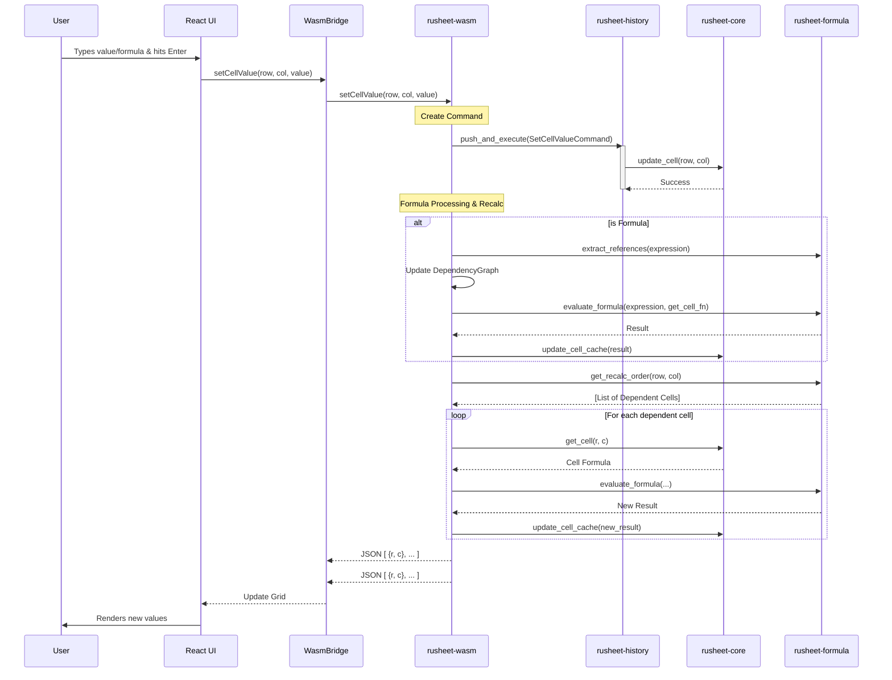
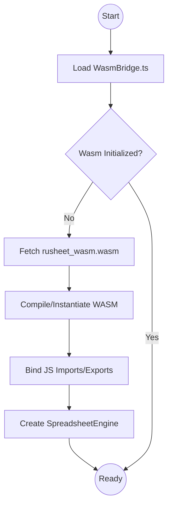
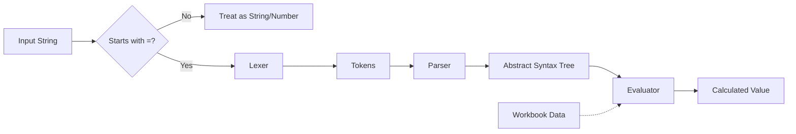

# Rusheet Flowcharts

This document details the critical data flows within Rusheet, specifically focusing on how user updates propagate through the system.

## Cell Update Flow

When a user edits a cell (e.g., typing "42" or "=SUM(A1:B1)"), the following process occurs:

## System Initialization Flow

How the application bootstraps the WASM core:

## Formula Evaluation Flow

Detailing how a formula string becomes a value:

