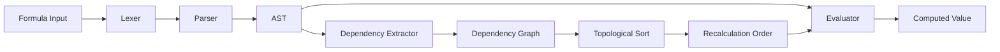

# Formula Engine Specification

## Overview

The RuSheet formula engine parses, validates, and evaluates spreadsheet formulas with Excel-compatible syntax. It implements incremental recalculation using a dependency graph to minimize computation when cells change, and supports advanced features like iterative calculation for circular references.

## Architecture



## Lexer & Parser

The formula syntax is a subset of Excel formula syntax.

*   **Lexer**: Produces tokens for References (`A1`, `Sheet1!A1`, `$A$1`), Literals (Numbers, Strings, Booleans), Operators, and Function calls.
*   **Parser**: Recursive descent or Pratt parser producing an AST.

## Dependency Graph

Track dependencies between cells for incremental recalculation.

```rust
// rusheet-formula/src/dependency_graph.rs

use std::collections::{HashMap, HashSet};

#[derive(Debug, Clone, Copy, PartialEq, Eq, Hash)]
pub struct CellId {
    pub row: usize,
    pub col: usize,
}

pub struct DependencyGraph {
    // Maps each cell to the cells it depends on (A1 -> [B1, C1])
    dependencies: HashMap<CellId, HashSet<CellId>>,

    // Reverse mapping: cells that depend on this cell (B1 -> [A1])
    dependents: HashMap<CellId, HashSet<CellId>>,

    // Cells with volatile functions (NOW, RAND) that need recalc every time
    volatile_cells: HashSet<CellId>,
}
```

### Topological Sort & Recalculation

When a cell changes, we perform a topological sort on its dependents to determine the correct recalculation order.

1.  Identify `dirty_roots` (the changed cells).
2.  Traverse `dependents` graph (BFS/DFS) to find all affected cells.
3.  Sort affected cells topologically.
4.  Evaluate in order.

### Circular References & Iterative Calculation

A "naive" engine crashes on `A1 = B1 + 1`, `B1 = A1 + 1`. RuSheet implements **Iterative Calculation** to handle this:

1.  **Cycle Detection**: During topological sort, if a cycle is detected, mark the involved SCC (Strongly Connected Component).
2.  **Iteration Strategy**:
    *   If `iterative_calculation` is OFF: Return `#CIRC!` error for all cells in the cycle.
    *   If `iterative_calculation` is ON:
        *   Loop max `N` times (e.g., 100).
        *   In each step, recalculate all cells in the cycle.
        *   Check for convergence: `abs(new_val - old_val) < epsilon` (e.g., 0.001).
        *   If converged or max loops reached, stop.

## Evaluator

The evaluator traverses the AST and computes values.

### Handling Ranges

Ranges (e.g., `A1:A5`) are first-class citizens. When a function like `SUM(A1:A5)` is called:

1.  The `Range` node in the AST is passed to the function.
2.  The function logic expands the range into a list of values by querying the `Workbook`.
3.  This avoids allocating massive arrays for large ranges (e.g., `A:A`).

```rust
pub enum Value {
    Number(f64),
    String(String),
    Boolean(bool),
    Error(ErrorType),
    // Ranges are typically expanded by functions, but can be passed as arguments
    Range(CellRange), 
}

impl Evaluator {
    fn eval_function(&self, name: &str, args: &[AstNode]) -> Value {
         match name {
             "SUM" => {
                 let mut sum = 0.0;
                 for arg in args {
                     match self.evaluate(arg) {
                         Value::Number(n) => sum += n,
                         Value::Range(r) => {
                             // Efficiently iterate over sparse grid
                             for cell in self.workbook.iter_range(r) {
                                 if let Value::Number(n) = cell.value {
                                     sum += n;
                                 }
                             }
                         },
                         _ => {}
                     }
                 }
                 Value::Number(sum)
             }
             // ...
         }
    }
}
```

### Volatile Functions

Functions like `RAND()`, `NOW()`, `TODAY()` are **volatile**.
*   They are marked in the `DependencyGraph`.
*   Any action that triggers a recalculation (even if unrelated to their dependencies) should re-evaluate these cells.

## Performance Optimization

*   **Result Caching**: Store the result of `evaluate(ast)` in the Cell struct.
*   **Dirty Flags**: Only re-parse the formula string if the string itself changes. If only dependencies change, reuse the existing AST.
*   **Vectorization (Future)**: Use SIMD for batch arithmetic operations on large ranges.

## References

- [IronCalc](https://github.com/ironcalc/IronCalc)
- [Excel Iterative Calculation](https://support.microsoft.com/en-us/office/remove-or-allow-a-circular-reference-8540bd0f-6e97-4483-bcf7-1b49cd50d123)