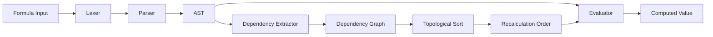

# Formula Engine Specification

## Overview

The RuSheet formula engine parses, validates, and evaluates spreadsheet formulas with Excel-compatible syntax. It implements incremental recalculation using a dependency graph to minimize computation when cells change.

## Architecture



## Lexer - Tokenization

The lexer converts formula strings into tokens.

```rust
// rusheet-formula/src/lexer.rs

use std::fmt;

#[derive(Debug, Clone, PartialEq)]
pub enum Token {
    // Literals
    Number(f64),
    String(String),
    Boolean(bool),

    // Operators
    Plus,
    Minus,
    Multiply,
    Divide,
    Power,
    Concat,

    // Comparison
    Equal,
    NotEqual,
    LessThan,
    LessThanOrEqual,
    GreaterThan,
    GreaterThanOrEqual,

    // References
    CellRef { row: usize, col: usize, absolute_row: bool, absolute_col: bool },
    RangeRef { start: Box<Token>, end: Box<Token> },

    // Functions
    Function(String),

    // Delimiters
    LeftParen,
    RightParen,
    Comma,
    Colon,

    // Special
    Error(String),
    Eof,
}

impl fmt::Display for Token {
    fn fmt(&self, f: &mut fmt::Formatter<'_>) -> fmt::Result {
        match self {
            Token::Number(n) => write!(f, "{}", n),
            Token::String(s) => write!(f, "\"{}\"", s),
            Token::Boolean(b) => write!(f, "{}", b),
            Token::Function(name) => write!(f, "{}(", name),
            _ => write!(f, "{:?}", self),
        }
    }
}

pub struct Lexer {
    input: Vec<char>,
    position: usize,
    current_char: Option<char>,
}

impl Lexer {
    pub fn new(input: &str) -> Self {
        let chars: Vec<char> = input.chars().collect();
        let current_char = chars.get(0).copied();

        Self {
            input: chars,
            position: 0,
            current_char,
        }
    }

    fn advance(&mut self) {
        self.position += 1;
        self.current_char = self.input.get(self.position).copied();
    }

    fn peek(&self, offset: usize) -> Option<char> {
        self.input.get(self.position + offset).copied()
    }

    fn skip_whitespace(&mut self) {
        while let Some(ch) = self.current_char {
            if ch.is_whitespace() {
                self.advance();
            } else {
                break;
            }
        }
    }

    fn read_number(&mut self) -> f64 {
        let mut num_str = String::new();

        while let Some(ch) = self.current_char {
            if ch.is_ascii_digit() || ch == '.' {
                num_str.push(ch);
                self.advance();
            } else {
                break;
            }
        }

        num_str.parse().unwrap_or(0.0)
    }

    fn read_string(&mut self) -> String {
        let mut result = String::new();
        self.advance(); // Skip opening quote

        while let Some(ch) = self.current_char {
            if ch == '"' {
                self.advance(); // Skip closing quote
                break;
            } else if ch == '\\' {
                self.advance();
                if let Some(escaped) = self.current_char {
                    result.push(escaped);
                    self.advance();
                }
            } else {
                result.push(ch);
                self.advance();
            }
        }

        result
    }

    fn read_identifier(&mut self) -> String {
        let mut result = String::new();

        while let Some(ch) = self.current_char {
            if ch.is_alphanumeric() || ch == '_' {
                result.push(ch);
                self.advance();
            } else {
                break;
            }
        }

        result
    }

    fn read_cell_ref(&mut self) -> Token {
        let mut ref_str = String::new();
        let mut absolute_col = false;
        let mut absolute_row = false;

        // Check for absolute column reference
        if self.current_char == Some('$') {
            absolute_col = true;
            self.advance();
        }

        // Read column letters
        let mut col_str = String::new();
        while let Some(ch) = self.current_char {
            if ch.is_ascii_alphabetic() {
                col_str.push(ch.to_ascii_uppercase());
                self.advance();
            } else {
                break;
            }
        }

        // Check for absolute row reference
        if self.current_char == Some('$') {
            absolute_row = true;
            self.advance();
        }

        // Read row number
        let mut row_str = String::new();
        while let Some(ch) = self.current_char {
            if ch.is_ascii_digit() {
                row_str.push(ch);
                self.advance();
            } else {
                break;
            }
        }

        // Convert column letters to index (A=0, Z=25, AA=26, etc.)
        let col = col_str.chars().fold(0, |acc, ch| {
            acc * 26 + (ch as usize - 'A' as usize + 1)
        }) - 1;

        let row = row_str.parse::<usize>().unwrap_or(1) - 1;

        Token::CellRef { row, col, absolute_row, absolute_col }
    }

    pub fn next_token(&mut self) -> Token {
        self.skip_whitespace();

        match self.current_char {
            None => Token::Eof,
            Some(ch) => match ch {
                '+' => {
                    self.advance();
                    Token::Plus
                }
                '-' => {
                    self.advance();
                    Token::Minus
                }
                '*' => {
                    self.advance();
                    Token::Multiply
                }
                '/' => {
                    self.advance();
                    Token::Divide
                }
                '^' => {
                    self.advance();
                    Token::Power
                }
                '&' => {
                    self.advance();
                    Token::Concat
                }
                '(' => {
                    self.advance();
                    Token::LeftParen
                }
                ')' => {
                    self.advance();
                    Token::RightParen
                }
                ',' => {
                    self.advance();
                    Token::Comma
                }
                ':' => {
                    self.advance();
                    Token::Colon
                }
                '=' => {
                    self.advance();
                    Token::Equal
                }
                '<' => {
                    self.advance();
                    if self.current_char == Some('=') {
                        self.advance();
                        Token::LessThanOrEqual
                    } else if self.current_char == Some('>') {
                        self.advance();
                        Token::NotEqual
                    } else {
                        Token::LessThan
                    }
                }
                '>' => {
                    self.advance();
                    if self.current_char == Some('=') {
                        self.advance();
                        Token::GreaterThanOrEqual
                    } else {
                        Token::GreaterThan
                    }
                }
                '"' => Token::String(self.read_string()),
                '0'..='9' => Token::Number(self.read_number()),
                'A'..='Z' | 'a'..='z' | '$' => {
                    // Could be cell reference or function
                    if ch == '$' || (ch.is_ascii_alphabetic() &&
                                    self.peek(1).map(|c| c.is_ascii_digit()).unwrap_or(false)) {
                        self.read_cell_ref()
                    } else {
                        let ident = self.read_identifier();
                        if self.current_char == Some('(') {
                            Token::Function(ident.to_uppercase())
                        } else if ident.eq_ignore_ascii_case("TRUE") {
                            Token::Boolean(true)
                        } else if ident.eq_ignore_ascii_case("FALSE") {
                            Token::Boolean(false)
                        } else {
                            Token::Error(format!("Unknown identifier: {}", ident))
                        }
                    }
                }
                _ => {
                    self.advance();
                    Token::Error(format!("Unexpected character: {}", ch))
                }
            }
        }
    }

    pub fn tokenize(&mut self) -> Vec<Token> {
        let mut tokens = Vec::new();
        loop {
            let token = self.next_token();
            if token == Token::Eof {
                break;
            }
            tokens.push(token);
        }
        tokens
    }
}
```

## Parser - AST Construction

The parser builds an Abstract Syntax Tree from tokens.

```rust
// rusheet-formula/src/parser.rs

use super::lexer::{Token, Lexer};

#[derive(Debug, Clone, PartialEq)]
pub enum AstNode {
    // Literals
    Number(f64),
    String(String),
    Boolean(bool),

    // References
    CellRef { row: usize, col: usize, absolute_row: bool, absolute_col: bool },
    Range { start: Box<AstNode>, end: Box<AstNode> },

    // Binary operations
    BinaryOp {
        op: BinaryOperator,
        left: Box<AstNode>,
        right: Box<AstNode>,
    },

    // Unary operations
    UnaryOp {
        op: UnaryOperator,
        operand: Box<AstNode>,
    },

    // Function calls
    FunctionCall {
        name: String,
        args: Vec<AstNode>,
    },

    // Error
    Error(String),
}

#[derive(Debug, Clone, Copy, PartialEq)]
pub enum BinaryOperator {
    Add,
    Subtract,
    Multiply,
    Divide,
    Power,
    Concat,
    Equal,
    NotEqual,
    LessThan,
    LessThanOrEqual,
    GreaterThan,
    GreaterThanOrEqual,
}

#[derive(Debug, Clone, Copy, PartialEq)]
pub enum UnaryOperator {
    Negate,
    Plus,
}

pub struct Parser {
    tokens: Vec<Token>,
    position: usize,
}

impl Parser {
    pub fn new(input: &str) -> Self {
        let mut lexer = Lexer::new(input);
        let tokens = lexer.tokenize();

        Self {
            tokens,
            position: 0,
        }
    }

    fn current_token(&self) -> &Token {
        self.tokens.get(self.position).unwrap_or(&Token::Eof)
    }

    fn advance(&mut self) {
        self.position += 1;
    }

    fn expect(&mut self, expected: Token) -> Result<(), String> {
        if self.current_token() == &expected {
            self.advance();
            Ok(())
        } else {
            Err(format!("Expected {:?}, got {:?}", expected, self.current_token()))
        }
    }

    pub fn parse(&mut self) -> AstNode {
        self.parse_expression()
    }

    // Precedence climbing parser
    fn parse_expression(&mut self) -> AstNode {
        self.parse_comparison()
    }

    fn parse_comparison(&mut self) -> AstNode {
        let mut node = self.parse_concat();

        loop {
            let op = match self.current_token() {
                Token::Equal => BinaryOperator::Equal,
                Token::NotEqual => BinaryOperator::NotEqual,
                Token::LessThan => BinaryOperator::LessThan,
                Token::LessThanOrEqual => BinaryOperator::LessThanOrEqual,
                Token::GreaterThan => BinaryOperator::GreaterThan,
                Token::GreaterThanOrEqual => BinaryOperator::GreaterThanOrEqual,
                _ => break,
            };

            self.advance();
            let right = self.parse_concat();
            node = AstNode::BinaryOp {
                op,
                left: Box::new(node),
                right: Box::new(right),
            };
        }

        node
    }

    fn parse_concat(&mut self) -> AstNode {
        let mut node = self.parse_addition();

        while matches!(self.current_token(), Token::Concat) {
            self.advance();
            let right = self.parse_addition();
            node = AstNode::BinaryOp {
                op: BinaryOperator::Concat,
                left: Box::new(node),
                right: Box::new(right),
            };
        }

        node
    }

    fn parse_addition(&mut self) -> AstNode {
        let mut node = self.parse_multiplication();

        loop {
            let op = match self.current_token() {
                Token::Plus => BinaryOperator::Add,
                Token::Minus => BinaryOperator::Subtract,
                _ => break,
            };

            self.advance();
            let right = self.parse_multiplication();
            node = AstNode::BinaryOp {
                op,
                left: Box::new(node),
                right: Box::new(right),
            };
        }

        node
    }

    fn parse_multiplication(&mut self) -> AstNode {
        let mut node = self.parse_power();

        loop {
            let op = match self.current_token() {
                Token::Multiply => BinaryOperator::Multiply,
                Token::Divide => BinaryOperator::Divide,
                _ => break,
            };

            self.advance();
            let right = self.parse_power();
            node = AstNode::BinaryOp {
                op,
                left: Box::new(node),
                right: Box::new(right),
            };
        }

        node
    }

    fn parse_power(&mut self) -> AstNode {
        let mut node = self.parse_unary();

        if matches!(self.current_token(), Token::Power) {
            self.advance();
            let right = self.parse_power(); // Right associative
            node = AstNode::BinaryOp {
                op: BinaryOperator::Power,
                left: Box::new(node),
                right: Box::new(right),
            };
        }

        node
    }

    fn parse_unary(&mut self) -> AstNode {
        match self.current_token() {
            Token::Minus => {
                self.advance();
                AstNode::UnaryOp {
                    op: UnaryOperator::Negate,
                    operand: Box::new(self.parse_unary()),
                }
            }
            Token::Plus => {
                self.advance();
                AstNode::UnaryOp {
                    op: UnaryOperator::Plus,
                    operand: Box::new(self.parse_unary()),
                }
            }
            _ => self.parse_primary(),
        }
    }

    fn parse_primary(&mut self) -> AstNode {
        match self.current_token().clone() {
            Token::Number(n) => {
                self.advance();
                AstNode::Number(n)
            }
            Token::String(s) => {
                self.advance();
                AstNode::String(s)
            }
            Token::Boolean(b) => {
                self.advance();
                AstNode::Boolean(b)
            }
            Token::CellRef { row, col, absolute_row, absolute_col } => {
                self.advance();

                // Check for range
                if matches!(self.current_token(), Token::Colon) {
                    self.advance();
                    let end = self.parse_primary();
                    AstNode::Range {
                        start: Box::new(AstNode::CellRef { row, col, absolute_row, absolute_col }),
                        end: Box::new(end),
                    }
                } else {
                    AstNode::CellRef { row, col, absolute_row, absolute_col }
                }
            }
            Token::Function(name) => {
                self.advance();
                self.expect(Token::LeftParen).ok();

                let mut args = Vec::new();

                if !matches!(self.current_token(), Token::RightParen) {
                    args.push(self.parse_expression());

                    while matches!(self.current_token(), Token::Comma) {
                        self.advance();
                        args.push(self.parse_expression());
                    }
                }

                self.expect(Token::RightParen).ok();

                AstNode::FunctionCall { name, args }
            }
            Token::LeftParen => {
                self.advance();
                let node = self.parse_expression();
                self.expect(Token::RightParen).ok();
                node
            }
            Token::Error(msg) => {
                self.advance();
                AstNode::Error(msg)
            }
            _ => {
                let msg = format!("Unexpected token: {:?}", self.current_token());
                self.advance();
                AstNode::Error(msg)
            }
        }
    }
}
```

## Dependency Graph

Track dependencies between cells for incremental recalculation.

```rust
// rusheet-formula/src/dependency_graph.rs

use std::collections::{HashMap, HashSet};

#[derive(Debug, Clone, Copy, PartialEq, Eq, Hash)]
pub struct CellId {
    pub row: usize,
    pub col: usize,
}

pub struct DependencyGraph {
    // Maps each cell to the cells it depends on
    dependencies: HashMap<CellId, HashSet<CellId>>,

    // Reverse mapping: cells that depend on this cell
    dependents: HashMap<CellId, HashSet<CellId>>,

    // Cells currently being evaluated (for circular reference detection)
    evaluation_stack: Vec<CellId>,
}

impl DependencyGraph {
    pub fn new() -> Self {
        Self {
            dependencies: HashMap::new(),
            dependents: HashMap::new(),
            evaluation_stack: Vec::new(),
        }
    }

    pub fn add_dependency(&mut self, cell: CellId, depends_on: CellId) {
        self.dependencies
            .entry(cell)
            .or_insert_with(HashSet::new)
            .insert(depends_on);

        self.dependents
            .entry(depends_on)
            .or_insert_with(HashSet::new)
            .insert(cell);
    }

    pub fn set_dependencies(&mut self, cell: CellId, deps: HashSet<CellId>) {
        // Remove old dependencies
        if let Some(old_deps) = self.dependencies.remove(&cell) {
            for dep in old_deps {
                if let Some(dependents) = self.dependents.get_mut(&dep) {
                    dependents.remove(&cell);
                }
            }
        }

        // Add new dependencies
        for dep in &deps {
            self.dependents
                .entry(*dep)
                .or_insert_with(HashSet::new)
                .insert(cell);
        }

        self.dependencies.insert(cell, deps);
    }

    pub fn get_dependencies(&self, cell: &CellId) -> Option<&HashSet<CellId>> {
        self.dependencies.get(cell)
    }

    pub fn get_dependents(&self, cell: &CellId) -> Option<&HashSet<CellId>> {
        self.dependents.get(cell)
    }

    pub fn remove_cell(&mut self, cell: &CellId) {
        if let Some(deps) = self.dependencies.remove(cell) {
            for dep in deps {
                if let Some(dependents) = self.dependents.get_mut(&dep) {
                    dependents.remove(cell);
                }
            }
        }

        if let Some(dependents) = self.dependents.remove(cell) {
            for dependent in dependents {
                if let Some(deps) = self.dependencies.get_mut(&dependent) {
                    deps.remove(cell);
                }
            }
        }
    }

    /// Detect circular reference
    pub fn has_circular_reference(&mut self, cell: CellId) -> bool {
        self.evaluation_stack.clear();
        self.detect_cycle(cell)
    }

    fn detect_cycle(&mut self, cell: CellId) -> bool {
        if self.evaluation_stack.contains(&cell) {
            return true;
        }

        self.evaluation_stack.push(cell);

        if let Some(deps) = self.dependencies.get(&cell) {
            for dep in deps {
                if self.detect_cycle(*dep) {
                    return true;
                }
            }
        }

        self.evaluation_stack.pop();
        false
    }

    /// Get cells that need recalculation when cell changes
    pub fn get_affected_cells(&self, changed_cell: CellId) -> Vec<CellId> {
        let mut affected = HashSet::new();
        let mut queue = vec![changed_cell];

        while let Some(cell) = queue.pop() {
            if let Some(dependents) = self.dependents.get(&cell) {
                for dependent in dependents {
                    if affected.insert(*dependent) {
                        queue.push(*dependent);
                    }
                }
            }
        }

        affected.into_iter().collect()
    }

    /// Topological sort for recalculation order
    pub fn get_calculation_order(&self, cells: &[CellId]) -> Result<Vec<CellId>, String> {
        let mut visited = HashSet::new();
        let mut temp_mark = HashSet::new();
        let mut result = Vec::new();

        for cell in cells {
            if !visited.contains(cell) {
                self.visit(*cell, &mut visited, &mut temp_mark, &mut result)?;
            }
        }

        Ok(result)
    }

    fn visit(
        &self,
        cell: CellId,
        visited: &mut HashSet<CellId>,
        temp_mark: &mut HashSet<CellId>,
        result: &mut Vec<CellId>,
    ) -> Result<(), String> {
        if temp_mark.contains(&cell) {
            return Err(format!("Circular reference detected at {:?}", cell));
        }

        if visited.contains(&cell) {
            return Ok(());
        }

        temp_mark.insert(cell);

        if let Some(deps) = self.dependencies.get(&cell) {
            for dep in deps {
                self.visit(*dep, visited, temp_mark, result)?;
            }
        }

        temp_mark.remove(&cell);
        visited.insert(cell);
        result.push(cell);

        Ok(())
    }
}
```

## Evaluator

Evaluate AST nodes to compute cell values.

```rust
// rusheet-formula/src/evaluator.rs

use super::parser::*;
use std::collections::HashMap;

#[derive(Debug, Clone, PartialEq)]
pub enum Value {
    Number(f64),
    String(String),
    Boolean(bool),
    Error(String),
}

pub struct Evaluator<'a> {
    // Callback to get cell value
    get_cell: Box<dyn Fn(usize, usize) -> Value + 'a>,
}

impl<'a> Evaluator<'a> {
    pub fn new<F>(get_cell: F) -> Self
    where
        F: Fn(usize, usize) -> Value + 'a,
    {
        Self {
            get_cell: Box::new(get_cell),
        }
    }

    pub fn evaluate(&self, node: &AstNode) -> Value {
        match node {
            AstNode::Number(n) => Value::Number(*n),
            AstNode::String(s) => Value::String(s.clone()),
            AstNode::Boolean(b) => Value::Boolean(*b),

            AstNode::CellRef { row, col, .. } => {
                (self.get_cell)(*row, *col)
            }

            AstNode::Range { start, end } => {
                // For now, return error - ranges need context
                Value::Error("Range not supported in this context".to_string())
            }

            AstNode::BinaryOp { op, left, right } => {
                self.eval_binary_op(*op, left, right)
            }

            AstNode::UnaryOp { op, operand } => {
                self.eval_unary_op(*op, operand)
            }

            AstNode::FunctionCall { name, args } => {
                self.eval_function(name, args)
            }

            AstNode::Error(msg) => Value::Error(msg.clone()),
        }
    }

    fn eval_binary_op(&self, op: BinaryOperator, left: &AstNode, right: &AstNode) -> Value {
        let left_val = self.evaluate(left);
        let right_val = self.evaluate(right);

        use BinaryOperator::*;
        match op {
            Add => self.add(left_val, right_val),
            Subtract => self.subtract(left_val, right_val),
            Multiply => self.multiply(left_val, right_val),
            Divide => self.divide(left_val, right_val),
            Power => self.power(left_val, right_val),
            Concat => self.concat(left_val, right_val),
            Equal => self.equal(left_val, right_val),
            NotEqual => self.not_equal(left_val, right_val),
            LessThan => self.less_than(left_val, right_val),
            LessThanOrEqual => self.less_than_or_equal(left_val, right_val),
            GreaterThan => self.greater_than(left_val, right_val),
            GreaterThanOrEqual => self.greater_than_or_equal(left_val, right_val),
        }
    }

    fn eval_unary_op(&self, op: UnaryOperator, operand: &AstNode) -> Value {
        let val = self.evaluate(operand);

        match op {
            UnaryOperator::Negate => {
                if let Value::Number(n) = val {
                    Value::Number(-n)
                } else {
                    Value::Error("Cannot negate non-number".to_string())
                }
            }
            UnaryOperator::Plus => val,
        }
    }

    fn add(&self, left: Value, right: Value) -> Value {
        match (left, right) {
            (Value::Number(a), Value::Number(b)) => Value::Number(a + b),
            _ => Value::Error("Type error in addition".to_string()),
        }
    }

    fn subtract(&self, left: Value, right: Value) -> Value {
        match (left, right) {
            (Value::Number(a), Value::Number(b)) => Value::Number(a - b),
            _ => Value::Error("Type error in subtraction".to_string()),
        }
    }

    fn multiply(&self, left: Value, right: Value) -> Value {
        match (left, right) {
            (Value::Number(a), Value::Number(b)) => Value::Number(a * b),
            _ => Value::Error("Type error in multiplication".to_string()),
        }
    }

    fn divide(&self, left: Value, right: Value) -> Value {
        match (left, right) {
            (Value::Number(a), Value::Number(b)) => {
                if b == 0.0 {
                    Value::Error("#DIV/0!".to_string())
                } else {
                    Value::Number(a / b)
                }
            }
            _ => Value::Error("Type error in division".to_string()),
        }
    }

    fn power(&self, left: Value, right: Value) -> Value {
        match (left, right) {
            (Value::Number(a), Value::Number(b)) => Value::Number(a.powf(b)),
            _ => Value::Error("Type error in power".to_string()),
        }
    }

    fn concat(&self, left: Value, right: Value) -> Value {
        let left_str = match left {
            Value::String(s) => s,
            Value::Number(n) => n.to_string(),
            Value::Boolean(b) => b.to_string(),
            Value::Error(e) => return Value::Error(e),
        };

        let right_str = match right {
            Value::String(s) => s,
            Value::Number(n) => n.to_string(),
            Value::Boolean(b) => b.to_string(),
            Value::Error(e) => return Value::Error(e),
        };

        Value::String(format!("{}{}", left_str, right_str))
    }

    fn equal(&self, left: Value, right: Value) -> Value {
        Value::Boolean(left == right)
    }

    fn not_equal(&self, left: Value, right: Value) -> Value {
        Value::Boolean(left != right)
    }

    fn less_than(&self, left: Value, right: Value) -> Value {
        match (left, right) {
            (Value::Number(a), Value::Number(b)) => Value::Boolean(a < b),
            _ => Value::Error("Type error in comparison".to_string()),
        }
    }

    fn less_than_or_equal(&self, left: Value, right: Value) -> Value {
        match (left, right) {
            (Value::Number(a), Value::Number(b)) => Value::Boolean(a <= b),
            _ => Value::Error("Type error in comparison".to_string()),
        }
    }

    fn greater_than(&self, left: Value, right: Value) -> Value {
        match (left, right) {
            (Value::Number(a), Value::Number(b)) => Value::Boolean(a > b),
            _ => Value::Error("Type error in comparison".to_string()),
        }
    }

    fn greater_than_or_equal(&self, left: Value, right: Value) -> Value {
        match (left, right) {
            (Value::Number(a), Value::Number(b)) => Value::Boolean(a >= b),
            _ => Value::Error("Type error in comparison".to_string()),
        }
    }

    fn eval_function(&self, name: &str, args: &[AstNode]) -> Value {
        match name {
            "SUM" => self.func_sum(args),
            "AVERAGE" | "AVG" => self.func_average(args),
            "IF" => self.func_if(args),
            "AND" => self.func_and(args),
            "OR" => self.func_or(args),
            "NOT" => self.func_not(args),
            _ => Value::Error(format!("Unknown function: {}", name)),
        }
    }

    fn func_sum(&self, args: &[AstNode]) -> Value {
        let mut sum = 0.0;

        for arg in args {
            match self.evaluate(arg) {
                Value::Number(n) => sum += n,
                Value::Error(e) => return Value::Error(e),
                _ => {}
            }
        }

        Value::Number(sum)
    }

    fn func_average(&self, args: &[AstNode]) -> Value {
        if args.is_empty() {
            return Value::Error("#DIV/0!".to_string());
        }

        let mut sum = 0.0;
        let mut count = 0;

        for arg in args {
            match self.evaluate(arg) {
                Value::Number(n) => {
                    sum += n;
                    count += 1;
                }
                Value::Error(e) => return Value::Error(e),
                _ => {}
            }
        }

        if count == 0 {
            Value::Error("#DIV/0!".to_string())
        } else {
            Value::Number(sum / count as f64)
        }
    }

    fn func_if(&self, args: &[AstNode]) -> Value {
        if args.len() < 2 || args.len() > 3 {
            return Value::Error("IF requires 2 or 3 arguments".to_string());
        }

        let condition = self.evaluate(&args[0]);

        match condition {
            Value::Boolean(true) => self.evaluate(&args[1]),
            Value::Boolean(false) => {
                if args.len() == 3 {
                    self.evaluate(&args[2])
                } else {
                    Value::Boolean(false)
                }
            }
            Value::Error(e) => Value::Error(e),
            _ => Value::Error("IF condition must be boolean".to_string()),
        }
    }

    fn func_and(&self, args: &[AstNode]) -> Value {
        for arg in args {
            match self.evaluate(arg) {
                Value::Boolean(false) => return Value::Boolean(false),
                Value::Boolean(true) => continue,
                Value::Error(e) => return Value::Error(e),
                _ => return Value::Error("AND requires boolean arguments".to_string()),
            }
        }
        Value::Boolean(true)
    }

    fn func_or(&self, args: &[AstNode]) -> Value {
        for arg in args {
            match self.evaluate(arg) {
                Value::Boolean(true) => return Value::Boolean(true),
                Value::Boolean(false) => continue,
                Value::Error(e) => return Value::Error(e),
                _ => return Value::Error("OR requires boolean arguments".to_string()),
            }
        }
        Value::Boolean(false)
    }

    fn func_not(&self, args: &[AstNode]) -> Value {
        if args.len() != 1 {
            return Value::Error("NOT requires exactly 1 argument".to_string());
        }

        match self.evaluate(&args[0]) {
            Value::Boolean(b) => Value::Boolean(!b),
            Value::Error(e) => Value::Error(e),
            _ => Value::Error("NOT requires boolean argument".to_string()),
        }
    }
}
```

## References

- [IronCalc](https://github.com/ironcalc/IronCalc) - Excel-compatible spreadsheet engine in Rust
- [Topological Sort](https://en.wikipedia.org/wiki/Topological_sorting)
- [Parsing Expression Grammar](https://en.wikipedia.org/wiki/Parsing_expression_grammar)
- [Excel Formula Reference](https://support.microsoft.com/en-us/office/excel-functions-by-category-5f91f4e9-7b42-46d2-9bd1-63f26a86c0eb)
