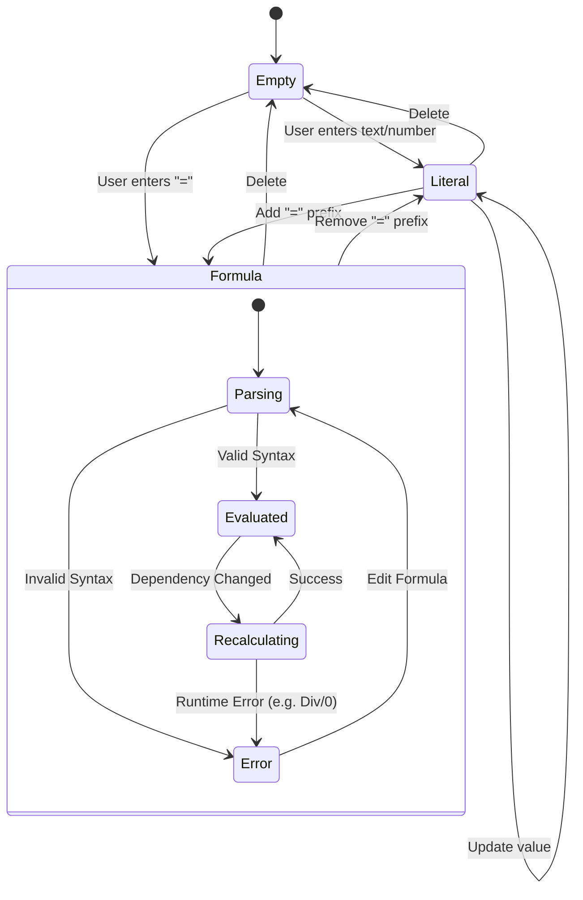
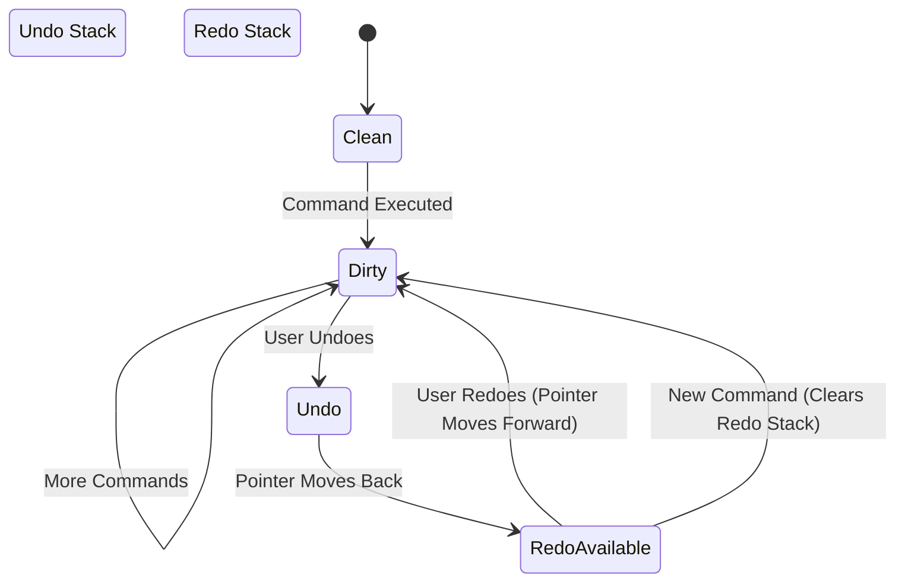

# Rusheet Finite State Machines (FSM)

This document describes the state models used to manage cell lifecycles and application history.

## Cell Lifecycle FSM

A cell in Rusheet is more than just a value; it has a dynamic state based on its content and validity.

### States Definition
1.  **Empty**: The initial state. No content, no formatting (default).
2.  **Literal**: Contains static data (String, Number, Boolean). No dependency tracking needed.
3.  **Formula**:
    *   **Parsing**: The string is being tokenized and parsed into an AST.
    *   **Evaluated**: The formula has been successfully calculated. The cell holds the cached result.
    *   **Recalculating**: A transient state when a dependency has changed, and the cell is waiting for a new value.
    *   **Error**: Represents either a Syntax Error (during parsing) or a Runtime Error (during evaluation, e.g., `#DIV/0!`, `#REF!`).

## History Stack FSM

The Undo/Redo system can be modeled as a linear state machine where the "Current State" pointer moves.

### Transitions
*   **Execute Command**: Pushes a new command onto the Undo Stack. **Clears** the Redo Stack.
*   **Undo**: Pops from Undo Stack, executes the inverse operation, pushes to Redo Stack.
*   **Redo**: Pops from Redo Stack, executes the original operation, pushes back to Undo Stack.
