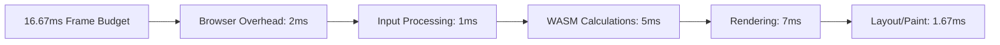

# Performance Specification

## Overview

This specification defines performance targets, optimization techniques, and profiling strategies for RuSheet. The goal is to maintain 60 FPS rendering and sub-100ms response times for common operations.

## Performance Budget

### 60 FPS Rendering Target

At 60 FPS, we have a 16.67ms budget per frame. This must be allocated carefully:



### Operation Time Budgets

| Operation | Target Time | Maximum Time |
|-----------|-------------|--------------|
| Cell edit | < 16ms | 50ms |
| Formula recalculation | < 50ms | 200ms |
| Scroll (viewport update) | < 8ms | 16ms |
| Insert/Delete row | < 100ms | 500ms |
| File import (10k cells) | < 1s | 5s |
| File export (10k cells) | < 1s | 5s |
| Search | < 200ms | 1s |

## Double Buffering

Prevent screen tearing and flickering with double buffering.

```typescript
// frontend/src/rendering/double-buffer.ts

export class DoubleBuffer {
  private frontCanvas: HTMLCanvasElement;
  private backCanvas: OffscreenCanvas;
  private backCtx: OffscreenCanvasRenderingContext2D;
  private renderPending: boolean = false;

  constructor(canvas: HTMLCanvasElement) {
    this.frontCanvas = canvas;
    this.backCanvas = new OffscreenCanvas(canvas.width, canvas.height);
    this.backCtx = this.backCanvas.getContext('2d', {
      alpha: false,
      desynchronized: true,
    })!;
  }

  render(renderFn: (ctx: OffscreenCanvasRenderingContext2D) => void): void {
    if (this.renderPending) return;

    this.renderPending = true;

    requestAnimationFrame(() => {
      // Render to back buffer
      const start = performance.now();
      renderFn(this.backCtx);
      const renderTime = performance.now() - start;

      // Swap buffers
      const frontCtx = this.frontCanvas.getContext('2d')!;
      frontCtx.clearRect(0, 0, this.frontCanvas.width, this.frontCanvas.height);
      frontCtx.drawImage(this.backCanvas, 0, 0);

      const totalTime = performance.now() - start;

      if (totalTime > 16.67) {
        console.warn(`Frame took ${totalTime.toFixed(2)}ms (render: ${renderTime.toFixed(2)}ms)`);
      }

      this.renderPending = false;
    });
  }

  resize(width: number, height: number): void {
    this.frontCanvas.width = width;
    this.frontCanvas.height = height;
    this.backCanvas.width = width;
    this.backCanvas.height = height;
  }
}
```

## Dirty Rectangle Optimization

Only repaint regions that have changed.

```rust
// rusheet-core/src/rendering/dirty_rect.rs

use std::collections::HashSet;

#[derive(Debug, Clone, Copy, PartialEq)]
pub struct Rect {
    pub x: f64,
    pub y: f64,
    pub width: f64,
    pub height: f64,
}

impl Rect {
    pub fn new(x: f64, y: f64, width: f64, height: f64) -> Self {
        Self { x, y, width, height }
    }

    pub fn intersects(&self, other: &Rect) -> bool {
        self.x < other.x + other.width
            && self.x + self.width > other.x
            && self.y < other.y + other.height
            && self.y + self.height > other.y
    }

    pub fn contains_point(&self, x: f64, y: f64) -> bool {
        x >= self.x && x <= self.x + self.width
            && y >= self.y && y <= self.y + self.height
    }

    pub fn union(&self, other: &Rect) -> Rect {
        let x = self.x.min(other.x);
        let y = self.y.min(other.y);
        let width = (self.x + self.width).max(other.x + other.width) - x;
        let height = (self.y + self.height).max(other.y + other.height) - y;

        Rect { x, y, width, height }
    }
}

pub struct DirtyRectManager {
    dirty_rects: Vec<Rect>,
    full_repaint: bool,
    viewport: Rect,
}

impl DirtyRectManager {
    pub fn new(viewport: Rect) -> Self {
        Self {
            dirty_rects: Vec::new(),
            full_repaint: true,
            viewport,
        }
    }

    pub fn mark_dirty(&mut self, rect: Rect) {
        if self.full_repaint {
            return;
        }

        // Only track dirty rects that intersect viewport
        if rect.intersects(&self.viewport) {
            self.dirty_rects.push(rect);

            // Merge overlapping rects if we have too many
            if self.dirty_rects.len() > 20 {
                self.merge_rects();
            }
        }
    }

    pub fn mark_cell_dirty(&mut self, row: usize, col: usize, mapper: &CoordinateMapper) {
        let rect = mapper.get_cell_rect(row, col);
        self.mark_dirty(Rect::new(rect.x, rect.y, rect.width, rect.height));
    }

    pub fn mark_range_dirty(&mut self, range: &CellRange, mapper: &CoordinateMapper) {
        let start_rect = mapper.get_cell_rect(range.start_row, range.start_col);
        let end_rect = mapper.get_cell_rect(range.end_row, range.end_col);

        let rect = Rect::new(
            start_rect.x,
            start_rect.y,
            end_rect.x + end_rect.width - start_rect.x,
            end_rect.y + end_rect.height - start_rect.y,
        );

        self.mark_dirty(rect);
    }

    pub fn mark_full_repaint(&mut self) {
        self.full_repaint = true;
        self.dirty_rects.clear();
    }

    pub fn get_dirty_rects(&self) -> Vec<Rect> {
        if self.full_repaint {
            vec![self.viewport]
        } else {
            self.dirty_rects.clone()
        }
    }

    pub fn clear(&mut self) {
        self.dirty_rects.clear();
        self.full_repaint = false;
    }

    pub fn set_viewport(&mut self, viewport: Rect) {
        if self.viewport.x != viewport.x || self.viewport.y != viewport.y {
            // Viewport scrolled, need full repaint
            self.full_repaint = true;
        }

        self.viewport = viewport;
    }

    fn merge_rects(&mut self) {
        let mut merged = Vec::new();

        for rect in &self.dirty_rects {
            let mut merged_into_existing = false;

            for existing in &mut merged {
                if rect.intersects(existing) {
                    *existing = existing.union(rect);
                    merged_into_existing = true;
                    break;
                }
            }

            if !merged_into_existing {
                merged.push(*rect);
            }
        }

        self.dirty_rects = merged;
    }

    pub fn needs_repaint(&self) -> bool {
        self.full_repaint || !self.dirty_rects.is_empty()
    }
}
```

## Web Worker Offloading

Move heavy computation to Web Workers to keep the main thread responsive.

```typescript
// frontend/src/performance/worker-scheduler.ts

export interface WorkerTask {
  id: string;
  type: string;
  payload: any;
  priority: number;
}

export class WorkerScheduler {
  private workers: Worker[] = [];
  private taskQueue: WorkerTask[] = [];
  private activeTasks: Map<string, Worker> = new Map();
  private callbacks: Map<string, (result: any) => void> = new Map();

  constructor(workerCount: number = navigator.hardwareConcurrency || 4) {
    for (let i = 0; i < workerCount; i++) {
      const worker = new Worker(
        new URL('../workers/calculation-worker.ts', import.meta.url),
        { type: 'module' }
      );

      worker.onmessage = (e: MessageEvent) => {
        this.handleWorkerMessage(e.data, worker);
      };

      this.workers.push(worker);
    }
  }

  scheduleTask(task: WorkerTask, callback: (result: any) => void): void {
    this.callbacks.set(task.id, callback);
    this.taskQueue.push(task);
    this.taskQueue.sort((a, b) => b.priority - a.priority);

    this.processQueue();
  }

  private processQueue(): void {
    const availableWorker = this.findAvailableWorker();

    if (!availableWorker || this.taskQueue.length === 0) {
      return;
    }

    const task = this.taskQueue.shift()!;
    this.activeTasks.set(task.id, availableWorker);

    availableWorker.postMessage({
      taskId: task.id,
      type: task.type,
      payload: task.payload,
    });
  }

  private findAvailableWorker(): Worker | null {
    for (const worker of this.workers) {
      let isAvailable = true;

      for (const activeWorker of this.activeTasks.values()) {
        if (activeWorker === worker) {
          isAvailable = false;
          break;
        }
      }

      if (isAvailable) {
        return worker;
      }
    }

    return null;
  }

  private handleWorkerMessage(data: any, worker: Worker): void {
    const { taskId, result } = data;
    const callback = this.callbacks.get(taskId);

    if (callback) {
      callback(result);
      this.callbacks.delete(taskId);
    }

    this.activeTasks.delete(taskId);
    this.processQueue();
  }

  terminate(): void {
    for (const worker of this.workers) {
      worker.terminate();
    }

    this.workers = [];
    this.taskQueue = [];
    this.activeTasks.clear();
    this.callbacks.clear();
  }
}
```

## Memory Optimization

### Object Pooling

```typescript
// frontend/src/performance/pools.ts

export class CellPool {
  private pool: any[] = [];
  private maxSize: number;

  constructor(maxSize: number = 1000) {
    this.maxSize = maxSize;
  }

  acquire(): any {
    if (this.pool.length > 0) {
      return this.pool.pop();
    }

    return {
      row: 0,
      col: 0,
      value: '',
      displayValue: '',
      style: null,
    };
  }

  release(cell: any): void {
    if (this.pool.length < this.maxSize) {
      // Reset cell
      cell.row = 0;
      cell.col = 0;
      cell.value = '';
      cell.displayValue = '';
      cell.style = null;

      this.pool.push(cell);
    }
  }

  clear(): void {
    this.pool = [];
  }

  get size(): number {
    return this.pool.length;
  }
}

export class RectPool {
  private pool: Rect[] = [];
  private maxSize: number;

  constructor(maxSize: number = 500) {
    this.maxSize = maxSize;
  }

  acquire(): Rect {
    if (this.pool.length > 0) {
      return this.pool.pop()!;
    }

    return { x: 0, y: 0, width: 0, height: 0 };
  }

  release(rect: Rect): void {
    if (this.pool.length < this.maxSize) {
      rect.x = 0;
      rect.y = 0;
      rect.width = 0;
      rect.height = 0;

      this.pool.push(rect);
    }
  }

  clear(): void {
    this.pool = [];
  }
}
```

### String Interning in Rust

```rust
// rusheet-core/src/performance/intern.rs

use std::collections::HashMap;
use std::sync::{Arc, RwLock};

lazy_static::lazy_static! {
    static ref STRING_INTERNER: RwLock<StringInterner> = RwLock::new(StringInterner::new());
}

pub struct StringInterner {
    strings: HashMap<String, Arc<str>>,
    stats: InternerStats,
}

#[derive(Debug, Default)]
pub struct InternerStats {
    pub total_interned: usize,
    pub cache_hits: usize,
    pub cache_misses: usize,
    pub memory_saved: usize,
}

impl StringInterner {
    pub fn new() -> Self {
        Self {
            strings: HashMap::new(),
            stats: InternerStats::default(),
        }
    }

    pub fn intern(&mut self, s: &str) -> Arc<str> {
        if let Some(interned) = self.strings.get(s) {
            self.stats.cache_hits += 1;
            self.stats.memory_saved += s.len();
            return interned.clone();
        }

        self.stats.cache_misses += 1;
        self.stats.total_interned += 1;

        let arc: Arc<str> = Arc::from(s);
        self.strings.insert(s.to_string(), arc.clone());
        arc
    }

    pub fn stats(&self) -> &InternerStats {
        &self.stats
    }

    pub fn clear(&mut self) {
        self.strings.clear();
        self.stats = InternerStats::default();
    }
}

pub fn intern_string(s: &str) -> Arc<str> {
    STRING_INTERNER.write().unwrap().intern(s)
}

pub fn get_interner_stats() -> InternerStats {
    STRING_INTERNER.read().unwrap().stats.clone()
}
```

## Profiling

### Performance Monitoring in TypeScript

```typescript
// frontend/src/performance/profiler.ts

export class PerformanceProfiler {
  private marks: Map<string, number> = new Map();
  private measurements: Map<string, number[]> = new Map();

  mark(name: string): void {
    this.marks.set(name, performance.now());
  }

  measure(name: string, startMark: string): number {
    const start = this.marks.get(startMark);

    if (!start) {
      console.warn(`No mark found for: ${startMark}`);
      return 0;
    }

    const duration = performance.now() - start;

    if (!this.measurements.has(name)) {
      this.measurements.set(name, []);
    }

    this.measurements.get(name)!.push(duration);

    return duration;
  }

  getStats(name: string): { avg: number; min: number; max: number; count: number } | null {
    const measurements = this.measurements.get(name);

    if (!measurements || measurements.length === 0) {
      return null;
    }

    return {
      avg: measurements.reduce((a, b) => a + b, 0) / measurements.length,
      min: Math.min(...measurements),
      max: Math.max(...measurements),
      count: measurements.length,
    };
  }

  logStats(): void {
    console.group('Performance Statistics');

    for (const [name, _] of this.measurements) {
      const stats = this.getStats(name);

      if (stats) {
        console.log(
          `${name}: avg=${stats.avg.toFixed(2)}ms, min=${stats.min.toFixed(2)}ms, max=${stats.max.toFixed(2)}ms (n=${stats.count})`
        );
      }
    }

    console.groupEnd();
  }

  clear(): void {
    this.marks.clear();
    this.measurements.clear();
  }
}

// Global profiler instance
export const profiler = new PerformanceProfiler();

// Usage example:
// profiler.mark('render-start');
// ... rendering code ...
// const duration = profiler.measure('render', 'render-start');
// if (duration > 16.67) {
//   console.warn(`Slow render: ${duration.toFixed(2)}ms`);
// }
```

### Memory Profiling in Rust

```rust
// rusheet-core/src/performance/memory.rs

use std::alloc::{GlobalAlloc, Layout, System};
use std::sync::atomic::{AtomicUsize, Ordering};

pub struct MemoryProfiler;

static ALLOCATED: AtomicUsize = AtomicUsize::new(0);
static DEALLOCATED: AtomicUsize = AtomicUsize::new(0);

unsafe impl GlobalAlloc for MemoryProfiler {
    unsafe fn alloc(&self, layout: Layout) -> *mut u8 {
        let ret = System.alloc(layout);
        if !ret.is_null() {
            ALLOCATED.fetch_add(layout.size(), Ordering::SeqCst);
        }
        ret
    }

    unsafe fn dealloc(&self, ptr: *mut u8, layout: Layout) {
        System.dealloc(ptr, layout);
        DEALLOCATED.fetch_add(layout.size(), Ordering::SeqCst);
    }
}

pub fn get_allocated_bytes() -> usize {
    ALLOCATED.load(Ordering::SeqCst)
}

pub fn get_deallocated_bytes() -> usize {
    DEALLOCATED.load(Ordering::SeqCst)
}

pub fn get_current_usage() -> usize {
    get_allocated_bytes().saturating_sub(get_deallocated_bytes())
}

pub fn reset_counters() {
    ALLOCATED.store(0, Ordering::SeqCst);
    DEALLOCATED.store(0, Ordering::SeqCst);
}

#[cfg(feature = "memory-profiling")]
#[global_allocator]
static GLOBAL: MemoryProfiler = MemoryProfiler;
```

## Benchmark Targets

```rust
// rusheet-core/benches/performance_bench.rs

use criterion::{black_box, criterion_group, criterion_main, Criterion};
use rusheet_core::*;

fn bench_cell_access(c: &mut Criterion) {
    let mut sheet = Sheet::new("Benchmark".to_string(), "bench".to_string());

    // Populate with data
    for row in 0..1000 {
        for col in 0..100 {
            sheet.set_cell_value(row, col, &format!("Cell {},{}", row, col));
        }
    }

    c.bench_function("cell_access_random", |b| {
        b.iter(|| {
            for i in 0..1000 {
                let row = (i * 7) % 1000;
                let col = (i * 13) % 100;
                black_box(sheet.get_cell(row, col));
            }
        });
    });
}

fn bench_formula_recalc(c: &mut Criterion) {
    let mut sheet = Sheet::new("Benchmark".to_string(), "bench".to_string());

    // Create formula chain
    for row in 0..100 {
        sheet.set_cell_value(row, 0, &row.to_string());

        if row > 0 {
            sheet.set_cell_value(row, 1, &format!("=A{} + 1", row));
        }
    }

    c.bench_function("formula_recalculation", |b| {
        b.iter(|| {
            sheet.set_cell_value(0, 0, "100");
            black_box(sheet.recalculate_all());
        });
    });
}

fn bench_rendering_data(c: &mut Criterion) {
    let mut sheet = Sheet::new("Benchmark".to_string(), "bench".to_string());

    for row in 0..1000 {
        for col in 0..100 {
            sheet.set_cell_value(row, col, &format!("{}", row * col));
        }
    }

    c.bench_function("get_viewport_data", |b| {
        b.iter(|| {
            black_box(sheet.get_viewport_data(0, 50, 0, 20));
        });
    });
}

criterion_group!(benches, bench_cell_access, bench_formula_recalc, bench_rendering_data);
criterion_main!(benches);
```

## Performance Monitoring Dashboard

```typescript
// frontend/src/performance/dashboard.ts

export class PerformanceDashboard {
  private frameTimings: number[] = [];
  private maxFrames: number = 60;

  recordFrame(duration: number): void {
    this.frameTimings.push(duration);

    if (this.frameTimings.length > this.maxFrames) {
      this.frameTimings.shift();
    }
  }

  getFPS(): number {
    if (this.frameTimings.length === 0) return 0;

    const avgFrameTime = this.frameTimings.reduce((a, b) => a + b, 0) / this.frameTimings.length;
    return 1000 / avgFrameTime;
  }

  getMetrics(): PerformanceMetrics {
    return {
      fps: this.getFPS(),
      avgFrameTime: this.frameTimings.reduce((a, b) => a + b, 0) / this.frameTimings.length,
      minFrameTime: Math.min(...this.frameTimings),
      maxFrameTime: Math.max(...this.frameTimings),
      droppedFrames: this.frameTimings.filter(t => t > 16.67).length,
    };
  }

  render(container: HTMLElement): void {
    const metrics = this.getMetrics();

    container.innerHTML = `
      <div style="font-family: monospace; padding: 10px; background: #000; color: #0f0;">
        <div>FPS: ${metrics.fps.toFixed(1)}</div>
        <div>Avg: ${metrics.avgFrameTime.toFixed(2)}ms</div>
        <div>Min: ${metrics.minFrameTime.toFixed(2)}ms</div>
        <div>Max: ${metrics.maxFrameTime.toFixed(2)}ms</div>
        <div>Dropped: ${metrics.droppedFrames}</div>
      </div>
    `;
  }
}

export interface PerformanceMetrics {
  fps: number;
  avgFrameTime: number;
  minFrameTime: number;
  maxFrameTime: number;
  droppedFrames: number;
}
```

## References

- [Chrome DevTools Performance](https://developer.chrome.com/docs/devtools/performance/)
- [Web Performance APIs](https://developer.mozilla.org/en-US/docs/Web/API/Performance)
- [requestAnimationFrame](https://developer.mozilla.org/en-US/docs/Web/API/window/requestAnimationFrame)
- [Criterion.rs - Rust Benchmarking](https://github.com/bheisler/criterion.rs)
- [RAIL Performance Model](https://web.dev/rail/)
