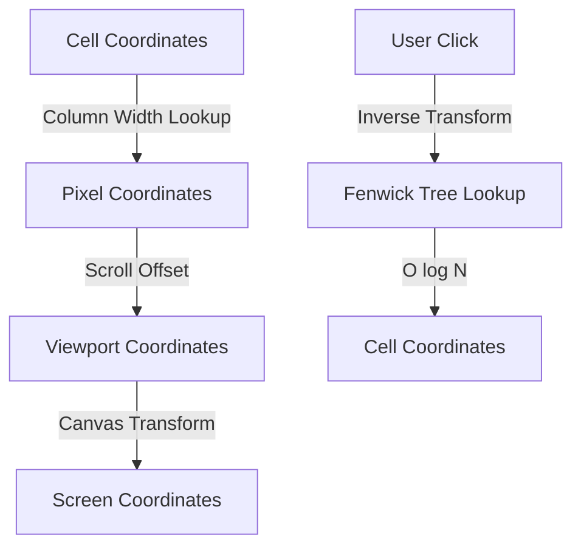
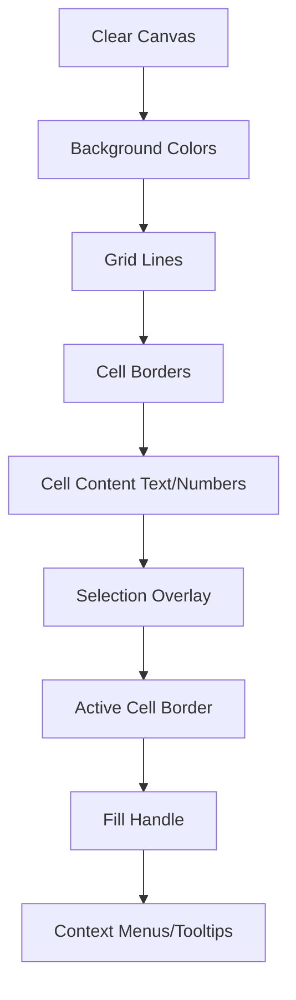

# Rendering Engine Specification

## Overview

The RuSheet rendering engine uses a hybrid Canvas/DOM approach for optimal performance and accessibility. The core rendering loop maintains 60 FPS through dirty rectangle tracking, virtual scrolling, and efficient coordinate mapping.

## Architecture

### Coordinate Systems

The rendering engine operates with multiple coordinate systems:

1. **Cell Coordinates** - (row, col) indices
2. **Pixel Coordinates** - Absolute canvas coordinates
3. **Viewport Coordinates** - Visible screen coordinates
4. **Scroll Coordinates** - Current scroll offset



### Fenwick Tree for O(log N) Hit Testing

To efficiently map pixel coordinates to cell coordinates, we use Fenwick Trees (Binary Indexed Trees) for both rows and columns.

```rust
// rusheet-core/src/rendering/coordinate_mapper.rs

use std::collections::HashMap;

pub struct FenwickTree {
    tree: Vec<f64>,
    size: usize,
}

impl FenwickTree {
    pub fn new(size: usize) -> Self {
        Self {
            tree: vec![0.0; size + 1],
            size,
        }
    }

    /// Update the value at index
    pub fn update(&mut self, mut idx: usize, delta: f64) {
        idx += 1; // 1-indexed
        while idx <= self.size {
            self.tree[idx] += delta;
            idx += idx & (!idx + 1);
        }
    }

    /// Get cumulative sum up to index
    pub fn query(&self, mut idx: usize) -> f64 {
        idx += 1; // 1-indexed
        let mut sum = 0.0;
        while idx > 0 {
            sum += self.tree[idx];
            idx -= idx & (!idx + 1);
        }
        sum
    }

    /// Binary search to find cell index from pixel coordinate
    pub fn find_index(&self, pixel: f64) -> usize {
        let mut left = 0;
        let mut right = self.size;

        while left < right {
            let mid = (left + right) / 2;
            if self.query(mid) < pixel {
                left = mid + 1;
            } else {
                right = mid;
            }
        }
        left
    }
}

pub struct CoordinateMapper {
    row_heights: FenwickTree,
    col_widths: FenwickTree,
    custom_heights: HashMap<usize, f64>,
    custom_widths: HashMap<usize, f64>,
    default_row_height: f64,
    default_col_width: f64,
}

impl CoordinateMapper {
    pub fn new(max_rows: usize, max_cols: usize) -> Self {
        let mut mapper = Self {
            row_heights: FenwickTree::new(max_rows),
            col_widths: FenwickTree::new(max_cols),
            custom_heights: HashMap::new(),
            custom_widths: HashMap::new(),
            default_row_height: 21.0,
            default_col_width: 64.0,
        };

        // Initialize with defaults
        for i in 0..max_rows {
            mapper.row_heights.update(i, mapper.default_row_height);
        }
        for i in 0..max_cols {
            mapper.col_widths.update(i, mapper.default_col_width);
        }

        mapper
    }

    pub fn set_row_height(&mut self, row: usize, height: f64) {
        let old_height = self.custom_heights.get(&row).copied()
            .unwrap_or(self.default_row_height);
        let delta = height - old_height;

        self.row_heights.update(row, delta);
        self.custom_heights.insert(row, height);
    }

    pub fn set_col_width(&mut self, col: usize, width: f64) {
        let old_width = self.custom_widths.get(&col).copied()
            .unwrap_or(self.default_col_width);
        let delta = width - old_width;

        self.col_widths.update(col, delta);
        self.custom_widths.insert(col, width);
    }

    /// Convert pixel coordinate to cell coordinate
    pub fn pixel_to_cell(&self, x: f64, y: f64) -> (usize, usize) {
        let row = self.row_heights.find_index(y);
        let col = self.col_widths.find_index(x);
        (row, col)
    }

    /// Get pixel position of cell
    pub fn cell_to_pixel(&self, row: usize, col: usize) -> (f64, f64) {
        let y = if row == 0 { 0.0 } else { self.row_heights.query(row - 1) };
        let x = if col == 0 { 0.0 } else { self.col_widths.query(col - 1) };
        (x, y)
    }

    /// Get cell dimensions
    pub fn get_cell_rect(&self, row: usize, col: usize) -> CellRect {
        let (x, y) = self.cell_to_pixel(row, col);
        let height = self.custom_heights.get(&row).copied()
            .unwrap_or(self.default_row_height);
        let width = self.custom_widths.get(&col).copied()
            .unwrap_or(self.default_col_width);

        CellRect { x, y, width, height }
    }
}

#[derive(Debug, Clone)]
pub struct CellRect {
    pub x: f64,
    pub y: f64,
    pub width: f64,
    pub height: f64,
}
```

### High-DPI Rendering

Support for high-DPI displays (Retina, etc.) requires scaling the canvas backing store.

```typescript
// frontend/src/rendering/canvas-setup.ts

export interface CanvasContext {
  canvas: HTMLCanvasElement;
  ctx: CanvasRenderingContext2D;
  dpr: number;
  width: number;
  height: number;
}

export function setupCanvas(container: HTMLElement): CanvasContext {
  const canvas = document.createElement('canvas');
  const ctx = canvas.getContext('2d', {
    alpha: false,
    desynchronized: true, // Hint for better performance
  })!;

  const dpr = window.devicePixelRatio || 1;

  // Set display size
  const rect = container.getBoundingClientRect();
  canvas.style.width = `${rect.width}px`;
  canvas.style.height = `${rect.height}px`;

  // Set backing store size (scaled for DPI)
  canvas.width = rect.width * dpr;
  canvas.height = rect.height * dpr;

  // Scale context to account for DPI
  ctx.scale(dpr, dpr);

  container.appendChild(canvas);

  return {
    canvas,
    ctx,
    dpr,
    width: rect.width,
    height: rect.height,
  };
}

export function resizeCanvas(canvasCtx: CanvasContext): void {
  const rect = canvasCtx.canvas.getBoundingClientRect();

  canvasCtx.width = rect.width;
  canvasCtx.height = rect.height;

  canvasCtx.canvas.width = rect.width * canvasCtx.dpr;
  canvasCtx.canvas.height = rect.height * canvasCtx.dpr;

  canvasCtx.ctx.scale(canvasCtx.dpr, canvasCtx.dpr);
}
```

### Virtual Scrolling Paint Loop

Only render visible cells plus a small buffer for smooth scrolling.

```rust
// rusheet-core/src/rendering/viewport.rs

#[derive(Debug, Clone)]
pub struct Viewport {
    pub scroll_x: f64,
    pub scroll_y: f64,
    pub width: f64,
    pub height: f64,
    pub buffer_rows: usize, // Extra rows to render beyond viewport
    pub buffer_cols: usize, // Extra columns to render beyond viewport
}

impl Viewport {
    pub fn new(width: f64, height: f64) -> Self {
        Self {
            scroll_x: 0.0,
            scroll_y: 0.0,
            width,
            height,
            buffer_rows: 3,
            buffer_cols: 3,
        }
    }

    /// Get visible cell range with buffer
    pub fn get_visible_range(&self, mapper: &CoordinateMapper) -> CellRange {
        let (start_row, start_col) = mapper.pixel_to_cell(self.scroll_x, self.scroll_y);
        let (end_row, end_col) = mapper.pixel_to_cell(
            self.scroll_x + self.width,
            self.scroll_y + self.height,
        );

        CellRange {
            start_row: start_row.saturating_sub(self.buffer_rows),
            end_row: end_row + self.buffer_rows,
            start_col: start_col.saturating_sub(self.buffer_cols),
            end_col: end_col + self.buffer_cols,
        }
    }

    /// Check if a cell is visible (including buffer)
    pub fn is_cell_visible(&self, row: usize, col: usize, mapper: &CoordinateMapper) -> bool {
        let range = self.get_visible_range(mapper);
        row >= range.start_row && row <= range.end_row &&
        col >= range.start_col && col <= range.end_col
    }
}

#[derive(Debug, Clone, Copy)]
pub struct CellRange {
    pub start_row: usize,
    pub end_row: usize,
    pub start_col: usize,
    pub end_col: usize,
}
```

### Layer Ordering

Render in multiple passes for correct visual layering:



```typescript
// frontend/src/rendering/renderer.ts

export class SheetRenderer {
  private canvas: CanvasContext;
  private viewport: Viewport;

  constructor(canvas: CanvasContext, viewport: Viewport) {
    this.canvas = canvas;
    this.viewport = viewport;
  }

  render(sheet: Sheet, selection: Selection): void {
    const ctx = this.canvas.ctx;
    const visibleRange = this.viewport.getVisibleRange();

    // Layer 1: Clear and fill background
    this.clearCanvas(ctx);

    // Layer 2: Background colors (cell fills)
    this.renderBackgrounds(ctx, sheet, visibleRange);

    // Layer 3: Grid lines
    this.renderGrid(ctx, visibleRange);

    // Layer 4: Cell borders (custom borders)
    this.renderBorders(ctx, sheet, visibleRange);

    // Layer 5: Cell content
    this.renderContent(ctx, sheet, visibleRange);

    // Layer 6: Selection overlay
    this.renderSelection(ctx, selection);

    // Layer 7: Active cell border
    this.renderActiveCell(ctx, selection.activeCell);

    // Layer 8: Fill handle
    if (selection.showFillHandle) {
      this.renderFillHandle(ctx, selection);
    }
  }

  private clearCanvas(ctx: CanvasRenderingContext2D): void {
    ctx.fillStyle = '#ffffff';
    ctx.fillRect(0, 0, this.canvas.width, this.canvas.height);
  }

  private renderBackgrounds(
    ctx: CanvasRenderingContext2D,
    sheet: Sheet,
    range: CellRange
  ): void {
    for (let row = range.startRow; row <= range.endRow; row++) {
      for (let col = range.startCol; col <= range.endCol; col++) {
        const cell = sheet.getCell(row, col);
        if (cell?.style?.backgroundColor) {
          const rect = this.viewport.getCellRect(row, col);
          ctx.fillStyle = cell.style.backgroundColor;
          ctx.fillRect(rect.x, rect.y, rect.width, rect.height);
        }
      }
    }
  }

  private renderGrid(
    ctx: CanvasRenderingContext2D,
    range: CellRange
  ): void {
    ctx.strokeStyle = '#e0e0e0';
    ctx.lineWidth = 1;

    // Vertical lines
    for (let col = range.startCol; col <= range.endCol + 1; col++) {
      const x = this.viewport.getColOffset(col);
      ctx.beginPath();
      ctx.moveTo(x, 0);
      ctx.lineTo(x, this.canvas.height);
      ctx.stroke();
    }

    // Horizontal lines
    for (let row = range.startRow; row <= range.endRow + 1; row++) {
      const y = this.viewport.getRowOffset(row);
      ctx.beginPath();
      ctx.moveTo(0, y);
      ctx.lineTo(this.canvas.width, y);
      ctx.stroke();
    }
  }

  private renderContent(
    ctx: CanvasRenderingContext2D,
    sheet: Sheet,
    range: CellRange
  ): void {
    for (let row = range.startRow; row <= range.endRow; row++) {
      for (let col = range.startCol; col <= range.endCol; col++) {
        const cell = sheet.getCell(row, col);
        if (!cell || !cell.displayValue) continue;

        const rect = this.viewport.getCellRect(row, col);
        this.renderCellText(ctx, cell, rect);
      }
    }
  }

  private renderCellText(
    ctx: CanvasRenderingContext2D,
    cell: Cell,
    rect: CellRect
  ): void {
    const style = cell.style || {};
    const padding = 4;

    ctx.font = `${style.fontSize || 11}px ${style.fontFamily || 'Arial'}`;
    ctx.fillStyle = style.color || '#000000';
    ctx.textBaseline = 'middle';

    // Text alignment
    const align = style.textAlign || 'left';
    let x = rect.x + padding;

    if (align === 'center') {
      x = rect.x + rect.width / 2;
      ctx.textAlign = 'center';
    } else if (align === 'right') {
      x = rect.x + rect.width - padding;
      ctx.textAlign = 'right';
    } else {
      ctx.textAlign = 'left';
    }

    const y = rect.y + rect.height / 2;

    // Clip to cell bounds
    ctx.save();
    ctx.beginPath();
    ctx.rect(rect.x, rect.y, rect.width, rect.height);
    ctx.clip();

    ctx.fillText(cell.displayValue, x, y);

    ctx.restore();
  }

  private renderSelection(
    ctx: CanvasRenderingContext2D,
    selection: Selection
  ): void {
    ctx.fillStyle = 'rgba(66, 133, 244, 0.1)';

    for (const range of selection.ranges) {
      const rect = this.viewport.getRangeRect(range);
      ctx.fillRect(rect.x, rect.y, rect.width, rect.height);
    }
  }

  private renderActiveCell(
    ctx: CanvasRenderingContext2D,
    activeCell: CellPosition
  ): void {
    const rect = this.viewport.getCellRect(activeCell.row, activeCell.col);

    ctx.strokeStyle = '#4285f4';
    ctx.lineWidth = 2;
    ctx.strokeRect(
      rect.x + 1,
      rect.y + 1,
      rect.width - 2,
      rect.height - 2
    );
  }

  private renderFillHandle(
    ctx: CanvasRenderingContext2D,
    selection: Selection
  ): void {
    const lastRange = selection.ranges[selection.ranges.length - 1];
    const rect = this.viewport.getCellRect(
      lastRange.endRow,
      lastRange.endCol
    );

    const size = 6;
    const x = rect.x + rect.width - size / 2;
    const y = rect.y + rect.height - size / 2;

    ctx.fillStyle = '#4285f4';
    ctx.fillRect(x - 1, y - 1, size, size);

    ctx.strokeStyle = '#ffffff';
    ctx.lineWidth = 1;
    ctx.strokeRect(x - 1, y - 1, size, size);
  }
}
```

## Performance Considerations

### Dirty Rectangle Tracking

Only repaint regions that have changed:

```rust
// rusheet-core/src/rendering/dirty_tracker.rs

use std::collections::HashSet;

pub struct DirtyTracker {
    dirty_cells: HashSet<(usize, usize)>,
    dirty_ranges: Vec<CellRange>,
    full_repaint: bool,
}

impl DirtyTracker {
    pub fn new() -> Self {
        Self {
            dirty_cells: HashSet::new(),
            dirty_ranges: Vec::new(),
            full_repaint: true,
        }
    }

    pub fn mark_cell_dirty(&mut self, row: usize, col: usize) {
        self.dirty_cells.insert((row, col));
    }

    pub fn mark_range_dirty(&mut self, range: CellRange) {
        self.dirty_ranges.push(range);
    }

    pub fn mark_full_repaint(&mut self) {
        self.full_repaint = true;
    }

    pub fn is_cell_dirty(&self, row: usize, col: usize) -> bool {
        if self.full_repaint {
            return true;
        }

        if self.dirty_cells.contains(&(row, col)) {
            return true;
        }

        for range in &self.dirty_ranges {
            if row >= range.start_row && row <= range.end_row &&
               col >= range.start_col && col <= range.end_col {
                return true;
            }
        }

        false
    }

    pub fn clear(&mut self) {
        self.dirty_cells.clear();
        self.dirty_ranges.clear();
        self.full_repaint = false;
    }
}
```

### Double Buffering

Use offscreen canvas for flicker-free rendering:

```typescript
// frontend/src/rendering/double-buffer.ts

export class DoubleBufferedRenderer {
  private frontBuffer: HTMLCanvasElement;
  private backBuffer: HTMLCanvasElement;
  private backCtx: CanvasRenderingContext2D;

  constructor(canvas: HTMLCanvasElement) {
    this.frontBuffer = canvas;
    this.backBuffer = document.createElement('canvas');
    this.backBuffer.width = canvas.width;
    this.backBuffer.height = canvas.height;
    this.backCtx = this.backBuffer.getContext('2d')!;
  }

  render(renderFn: (ctx: CanvasRenderingContext2D) => void): void {
    // Render to back buffer
    renderFn(this.backCtx);

    // Swap buffers by copying to front
    const frontCtx = this.frontBuffer.getContext('2d')!;
    frontCtx.clearRect(0, 0, this.frontBuffer.width, this.frontBuffer.height);
    frontCtx.drawImage(this.backBuffer, 0, 0);
  }
}
```

## Testing Strategy

### Unit Tests

```rust
#[cfg(test)]
mod tests {
    use super::*;

    #[test]
    fn test_fenwick_tree_query() {
        let mut tree = FenwickTree::new(10);
        for i in 0..10 {
            tree.update(i, 10.0);
        }

        assert_eq!(tree.query(4), 50.0); // Sum of 5 elements
        assert_eq!(tree.query(9), 100.0); // Sum of all 10 elements
    }

    #[test]
    fn test_coordinate_mapping() {
        let mut mapper = CoordinateMapper::new(100, 100);

        // Set custom dimensions
        mapper.set_row_height(5, 42.0);
        mapper.set_col_width(10, 120.0);

        // Test pixel to cell
        let (row, col) = mapper.pixel_to_cell(640.0, 105.0);
        assert_eq!(row, 5);
        assert_eq!(col, 10);

        // Test cell to pixel
        let (x, y) = mapper.cell_to_pixel(5, 10);
        assert_eq!(x, 640.0);
        assert_eq!(y, 105.0);
    }

    #[test]
    fn test_viewport_visible_range() {
        let mapper = CoordinateMapper::new(1000, 100);
        let viewport = Viewport::new(800.0, 600.0);

        let range = viewport.get_visible_range(&mapper);

        // Should include buffer cells
        assert!(range.end_row > range.start_row);
        assert!(range.end_col > range.start_col);
    }
}
```

## References

- [Fenwick Tree (Binary Indexed Tree)](https://en.wikipedia.org/wiki/Fenwick_tree)
- [Canvas API - MDN](https://developer.mozilla.org/en-US/docs/Web/API/Canvas_API)
- [High DPI Canvas](https://developer.mozilla.org/en-US/docs/Web/API/Window/devicePixelRatio)
- Virtual scrolling techniques from [react-window](https://github.com/bvaughn/react-window)