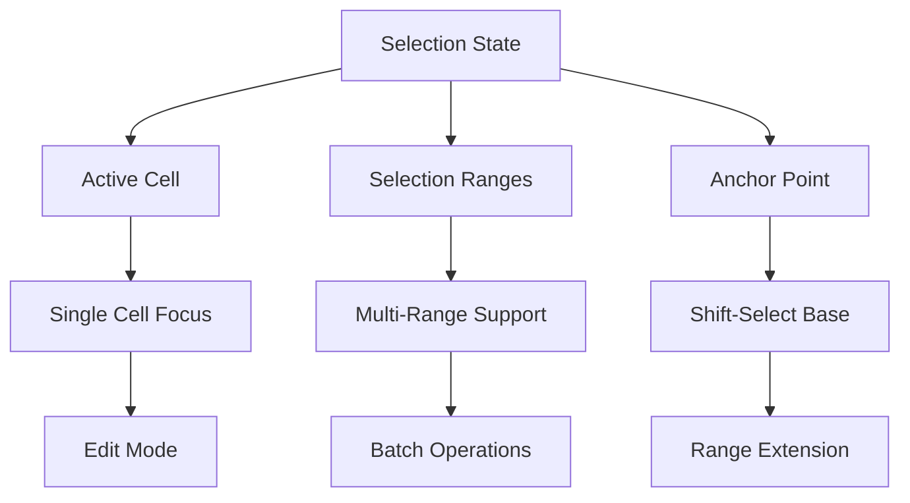

# User Experience Specification

## Overview

RuSheet provides a familiar spreadsheet interface with keyboard navigation, mouse selection, fill handle functionality, and comprehensive undo/redo. This specification defines the interaction model and implementation patterns.

## Selection Model

### Architecture



### Implementation

```rust
// rusheet-core/src/selection.rs

use serde::{Serialize, Deserialize};

#[derive(Debug, Clone, Copy, PartialEq, Eq, Hash, Serialize, Deserialize)]
pub struct CellPosition {
    pub row: usize,
    pub col: usize,
}

impl CellPosition {
    pub fn new(row: usize, col: usize) -> Self {
        Self { row, col }
    }
}

#[derive(Debug, Clone, Copy, PartialEq, Eq, Serialize, Deserialize)]
pub struct SelectionRange {
    pub start_row: usize,
    pub start_col: usize,
    pub end_row: usize,
    pub end_col: usize,
}

impl SelectionRange {
    pub fn new(start_row: usize, start_col: usize, end_row: usize, end_col: usize) -> Self {
        Self {
            start_row: start_row.min(end_row),
            start_col: start_col.min(end_col),
            end_row: start_row.max(end_row),
            end_col: start_col.max(end_col),
        }
    }

    pub fn from_cells(start: CellPosition, end: CellPosition) -> Self {
        Self::new(start.row, start.col, end.row, end.col)
    }

    pub fn single_cell(pos: CellPosition) -> Self {
        Self::new(pos.row, pos.col, pos.row, pos.col)
    }

    pub fn contains(&self, row: usize, col: usize) -> bool {
        row >= self.start_row && row <= self.end_row &&
        col >= self.start_col && col <= self.end_col
    }

    pub fn cell_count(&self) -> usize {
        (self.end_row - self.start_row + 1) * (self.end_col - self.start_col + 1)
    }

    pub fn row_count(&self) -> usize {
        self.end_row - self.start_row + 1
    }

    pub fn col_count(&self) -> usize {
        self.end_col - self.start_col + 1
    }

    pub fn iter_cells(&self) -> impl Iterator<Item = CellPosition> {
        let start_row = self.start_row;
        let end_row = self.end_row;
        let start_col = self.start_col;
        let end_col = self.end_col;

        (start_row..=end_row).flat_map(move |row| {
            (start_col..=end_col).map(move |col| CellPosition::new(row, col))
        })
    }
}

#[derive(Debug, Clone, Serialize, Deserialize)]
pub struct Selection {
    /// The active cell (has focus, where typing goes)
    pub active_cell: CellPosition,

    /// The anchor point for shift-select
    pub anchor: CellPosition,

    /// All selected ranges (can have multiple for Ctrl+click)
    pub ranges: Vec<SelectionRange>,

    /// Whether to show the fill handle
    pub show_fill_handle: bool,

    /// Edit mode state
    pub is_editing: bool,
}

impl Selection {
    pub fn new(cell: CellPosition) -> Self {
        Self {
            active_cell: cell,
            anchor: cell,
            ranges: vec![SelectionRange::single_cell(cell)],
            show_fill_handle: true,
            is_editing: false,
        }
    }

    /// Set selection to a single cell
    pub fn select_cell(&mut self, cell: CellPosition) {
        self.active_cell = cell;
        self.anchor = cell;
        self.ranges = vec![SelectionRange::single_cell(cell)];
    }

    /// Extend selection to include a cell (Shift+Click)
    pub fn extend_to(&mut self, cell: CellPosition) {
        self.active_cell = cell;
        self.ranges = vec![SelectionRange::from_cells(self.anchor, cell)];
    }

    /// Add a new selection range (Ctrl+Click)
    pub fn add_range(&mut self, range: SelectionRange) {
        self.ranges.push(range);
        self.active_cell = CellPosition::new(range.end_row, range.end_col);
    }

    /// Select entire row
    pub fn select_row(&mut self, row: usize, max_col: usize) {
        let range = SelectionRange::new(row, 0, row, max_col);
        self.ranges = vec![range];
        self.active_cell = CellPosition::new(row, 0);
        self.anchor = self.active_cell;
    }

    /// Select entire column
    pub fn select_column(&mut self, col: usize, max_row: usize) {
        let range = SelectionRange::new(0, col, max_row, col);
        self.ranges = vec![range];
        self.active_cell = CellPosition::new(0, col);
        self.anchor = self.active_cell;
    }

    /// Select all cells
    pub fn select_all(&mut self, max_row: usize, max_col: usize) {
        let range = SelectionRange::new(0, 0, max_row, max_col);
        self.ranges = vec![range];
        self.active_cell = CellPosition::new(0, 0);
        self.anchor = self.active_cell;
    }

    /// Check if a cell is in any selection range
    pub fn is_selected(&self, row: usize, col: usize) -> bool {
        self.ranges.iter().any(|range| range.contains(row, col))
    }

    /// Get primary selection range
    pub fn primary_range(&self) -> &SelectionRange {
        &self.ranges[0]
    }

    /// Get all selected cells
    pub fn get_all_cells(&self) -> Vec<CellPosition> {
        let mut cells = Vec::new();
        for range in &self.ranges {
            cells.extend(range.iter_cells());
        }
        cells
    }
}
```

## Fill Handle

The fill handle allows users to quickly copy or auto-fill cell patterns by dragging.

### Pattern Detection

```rust
// rusheet-core/src/fill.rs

use super::selection::{CellPosition, SelectionRange};

#[derive(Debug, Clone, PartialEq)]
pub enum FillPattern {
    Copy,
    Linear { start: f64, step: f64 },
    Date { start: chrono::NaiveDate, days: i64 },
    DayOfWeek { start: chrono::Weekday },
    Month { start: u32 },
    CustomList(Vec<String>),
}

pub struct FillDetector;

impl FillDetector {
    /// Detect pattern from source cells
    pub fn detect_pattern(values: &[String]) -> FillPattern {
        if values.is_empty() {
            return FillPattern::Copy;
        }

        // Try to parse as numbers
        let numbers: Vec<Option<f64>> = values
            .iter()
            .map(|s| s.parse::<f64>().ok())
            .collect();

        if numbers.iter().all(|n| n.is_some()) {
            let nums: Vec<f64> = numbers.into_iter().flatten().collect();
            if let Some(pattern) = Self::detect_numeric_pattern(&nums) {
                return pattern;
            }
        }

        // Try to parse as dates
        if let Some(pattern) = Self::detect_date_pattern(values) {
            return pattern;
        }

        // Try day of week
        if let Some(pattern) = Self::detect_day_pattern(values) {
            return pattern;
        }

        // Try month names
        if let Some(pattern) = Self::detect_month_pattern(values) {
            return pattern;
        }

        // Default to copy
        FillPattern::Copy
    }

    fn detect_numeric_pattern(nums: &[f64]) -> Option<FillPattern> {
        if nums.len() < 2 {
            return None;
        }

        // Check for linear progression
        let diffs: Vec<f64> = nums.windows(2).map(|w| w[1] - w[0]).collect();
        let avg_diff = diffs.iter().sum::<f64>() / diffs.len() as f64;

        // Check if differences are consistent
        let variance = diffs.iter()
            .map(|d| (d - avg_diff).powi(2))
            .sum::<f64>() / diffs.len() as f64;

        if variance < 0.0001 {
            Some(FillPattern::Linear {
                start: nums[0],
                step: avg_diff,
            })
        } else {
            None
        }
    }

    fn detect_date_pattern(values: &[String]) -> Option<FillPattern> {
        use chrono::NaiveDate;

        let dates: Vec<Option<NaiveDate>> = values
            .iter()
            .map(|s| NaiveDate::parse_from_str(s, "%Y-%m-%d").ok())
            .collect();

        if !dates.iter().all(|d| d.is_some()) {
            return None;
        }

        let dates: Vec<NaiveDate> = dates.into_iter().flatten().collect();

        if dates.len() < 2 {
            return None;
        }

        // Calculate day differences
        let diffs: Vec<i64> = dates.windows(2)
            .map(|w| (w[1] - w[0]).num_days())
            .collect();

        // Check consistency
        if diffs.iter().all(|&d| d == diffs[0]) {
            Some(FillPattern::Date {
                start: dates[0],
                days: diffs[0],
            })
        } else {
            None
        }
    }

    fn detect_day_pattern(values: &[String]) -> Option<FillPattern> {
        use chrono::Weekday;

        let days = ["Monday", "Tuesday", "Wednesday", "Thursday", "Friday", "Saturday", "Sunday"];

        for (i, day) in days.iter().enumerate() {
            if values[0].eq_ignore_ascii_case(day) {
                let weekday = match i {
                    0 => Weekday::Mon,
                    1 => Weekday::Tue,
                    2 => Weekday::Wed,
                    3 => Weekday::Thu,
                    4 => Weekday::Fri,
                    5 => Weekday::Sat,
                    6 => Weekday::Sun,
                    _ => unreachable!(),
                };
                return Some(FillPattern::DayOfWeek { start: weekday });
            }
        }

        None
    }

    fn detect_month_pattern(values: &[String]) -> Option<FillPattern> {
        let months = ["January", "February", "March", "April", "May", "June",
                     "July", "August", "September", "October", "November", "December"];

        for (i, month) in months.iter().enumerate() {
            if values[0].eq_ignore_ascii_case(month) {
                return Some(FillPattern::Month { start: i as u32 + 1 });
            }
        }

        None
    }

    /// Generate fill values
    pub fn generate_values(pattern: &FillPattern, count: usize) -> Vec<String> {
        match pattern {
            FillPattern::Copy => vec![], // Handled separately

            FillPattern::Linear { start, step } => {
                (0..count)
                    .map(|i| format!("{}", start + step * i as f64))
                    .collect()
            }

            FillPattern::Date { start, days } => {
                use chrono::Duration;
                (0..count)
                    .map(|i| {
                        (*start + Duration::days(*days * i as i64))
                            .format("%Y-%m-%d")
                            .to_string()
                    })
                    .collect()
            }

            FillPattern::DayOfWeek { start } => {
                use chrono::Weekday;
                let days = [Weekday::Mon, Weekday::Tue, Weekday::Wed, Weekday::Thu,
                           Weekday::Fri, Weekday::Sat, Weekday::Sun];
                let start_idx = days.iter().position(|&d| d == *start).unwrap();

                (0..count)
                    .map(|i| {
                        let day = days[(start_idx + i) % 7];
                        format!("{:?}", day)
                    })
                    .collect()
            }

            FillPattern::Month { start } => {
                let months = ["January", "February", "March", "April", "May", "June",
                             "July", "August", "September", "October", "November", "December"];

                (0..count)
                    .map(|i| {
                        let month_idx = ((start - 1) as usize + i) % 12;
                        months[month_idx].to_string()
                    })
                    .collect()
            }

            FillPattern::CustomList(list) => {
                (0..count)
                    .map(|i| list[i % list.len()].clone())
                    .collect()
            }
        }
    }
}
```

## Keyboard Navigation

```rust
// rusheet-core/src/keyboard.rs

use super::selection::{CellPosition, Selection};

#[derive(Debug, Clone, Copy, PartialEq, Eq)]
pub enum NavigationDirection {
    Up,
    Down,
    Left,
    Right,
    PageUp,
    PageDown,
    Home,
    End,
    CtrlHome,
    CtrlEnd,
}

pub struct KeyboardNavigator {
    max_rows: usize,
    max_cols: usize,
    page_size: usize, // Number of visible rows
}

impl KeyboardNavigator {
    pub fn new(max_rows: usize, max_cols: usize, page_size: usize) -> Self {
        Self {
            max_rows,
            max_cols,
            page_size,
        }
    }

    pub fn navigate(
        &self,
        selection: &mut Selection,
        direction: NavigationDirection,
        extend: bool, // Shift key held
    ) {
        let current = selection.active_cell;
        let new_cell = self.calculate_new_position(current, direction);

        if extend {
            selection.extend_to(new_cell);
        } else {
            selection.select_cell(new_cell);
        }
    }

    fn calculate_new_position(
        &self,
        current: CellPosition,
        direction: NavigationDirection,
    ) -> CellPosition {
        use NavigationDirection::*;

        match direction {
            Up => CellPosition::new(
                current.row.saturating_sub(1),
                current.col,
            ),

            Down => CellPosition::new(
                (current.row + 1).min(self.max_rows - 1),
                current.col,
            ),

            Left => CellPosition::new(
                current.row,
                current.col.saturating_sub(1),
            ),

            Right => CellPosition::new(
                current.row,
                (current.col + 1).min(self.max_cols - 1),
            ),

            PageUp => CellPosition::new(
                current.row.saturating_sub(self.page_size),
                current.col,
            ),

            PageDown => CellPosition::new(
                (current.row + self.page_size).min(self.max_rows - 1),
                current.col,
            ),

            Home => CellPosition::new(current.row, 0),

            End => {
                // Find last non-empty cell in row
                // For now, just go to last column
                CellPosition::new(current.row, self.max_cols - 1)
            }

            CtrlHome => CellPosition::new(0, 0),

            CtrlEnd => {
                // Find last used cell in sheet
                // For now, just go to max
                CellPosition::new(self.max_rows - 1, self.max_cols - 1)
            }
        }
    }
}
```

## Undo/Redo System

Using the Command pattern for undo/redo.

```rust
// rusheet-core/src/commands.rs

use super::selection::CellPosition;
use std::collections::VecDeque;

pub trait Command: std::fmt::Debug {
    fn execute(&mut self, sheet: &mut Sheet) -> Result<(), String>;
    fn undo(&mut self, sheet: &mut Sheet) -> Result<(), String>;
    fn description(&self) -> String;
}

#[derive(Debug)]
pub struct SetCellValueCommand {
    position: CellPosition,
    new_value: String,
    old_value: Option<String>,
}

impl SetCellValueCommand {
    pub fn new(position: CellPosition, new_value: String) -> Self {
        Self {
            position,
            new_value,
            old_value: None,
        }
    }
}

impl Command for SetCellValueCommand {
    fn execute(&mut self, sheet: &mut Sheet) -> Result<(), String> {
        // Save old value for undo
        self.old_value = sheet
            .get_cell(self.position.row, self.position.col)
            .map(|cell| cell.value.to_string());

        // Set new value
        sheet.set_cell_value(
            self.position.row,
            self.position.col,
            &self.new_value,
        );

        Ok(())
    }

    fn undo(&mut self, sheet: &mut Sheet) -> Result<(), String> {
        if let Some(old_value) = &self.old_value {
            sheet.set_cell_value(
                self.position.row,
                self.position.col,
                old_value,
            );
        } else {
            sheet.clear_cell(self.position.row, self.position.col);
        }

        Ok(())
    }

    fn description(&self) -> String {
        format!("Set cell value at {:?}", self.position)
    }
}

pub struct UndoManager {
    undo_stack: VecDeque<Box<dyn Command>>,
    redo_stack: VecDeque<Box<dyn Command>>,
    max_undo_levels: usize,
}

impl UndoManager {
    pub fn new(max_undo_levels: usize) -> Self {
        Self {
            undo_stack: VecDeque::new(),
            redo_stack: VecDeque::new(),
            max_undo_levels,
        }
    }

    pub fn execute(&mut self, mut command: Box<dyn Command>, sheet: &mut Sheet) -> Result<(), String> {
        command.execute(sheet)?;

        // Clear redo stack when new command is executed
        self.redo_stack.clear();

        // Add to undo stack
        self.undo_stack.push_back(command);

        // Limit undo stack size
        while self.undo_stack.len() > self.max_undo_levels {
            self.undo_stack.pop_front();
        }

        Ok(())
    }

    pub fn undo(&mut self, sheet: &mut Sheet) -> Result<(), String> {
        if let Some(mut command) = self.undo_stack.pop_back() {
            command.undo(sheet)?;
            self.redo_stack.push_back(command);
            Ok(())
        } else {
            Err("Nothing to undo".to_string())
        }
    }

    pub fn redo(&mut self, sheet: &mut Sheet) -> Result<(), String> {
        if let Some(mut command) = self.redo_stack.pop_back() {
            command.execute(sheet)?;
            self.undo_stack.push_back(command);
            Ok(())
        } else {
            Err("Nothing to redo".to_string())
        }
    }

    pub fn can_undo(&self) -> bool {
        !self.undo_stack.is_empty()
    }

    pub fn can_redo(&self) -> bool {
        !self.redo_stack.is_empty()
    }

    pub fn clear(&mut self) {
        self.undo_stack.clear();
        self.redo_stack.clear();
    }
}
```

## TypeScript Integration

```typescript
// frontend/src/selection/selection-manager.ts

import type { CellPosition, SelectionRange } from './types';

export class SelectionManager {
  private activeCell: CellPosition;
  private anchor: CellPosition;
  private ranges: SelectionRange[];
  private isEditing: boolean = false;

  constructor(initialCell: CellPosition) {
    this.activeCell = initialCell;
    this.anchor = initialCell;
    this.ranges = [{
      startRow: initialCell.row,
      startCol: initialCell.col,
      endRow: initialCell.row,
      endCol: initialCell.col,
    }];
  }

  selectCell(cell: CellPosition, addToSelection: boolean = false): void {
    if (addToSelection) {
      this.ranges.push({
        startRow: cell.row,
        startCol: cell.col,
        endRow: cell.row,
        endCol: cell.col,
      });
    } else {
      this.ranges = [{
        startRow: cell.row,
        startCol: cell.col,
        endRow: cell.row,
        endCol: cell.col,
      }];
      this.anchor = cell;
    }

    this.activeCell = cell;
    this.notifyChange();
  }

  extendSelection(cell: CellPosition): void {
    this.ranges = [{
      startRow: Math.min(this.anchor.row, cell.row),
      startCol: Math.min(this.anchor.col, cell.col),
      endRow: Math.max(this.anchor.row, cell.row),
      endCol: Math.max(this.anchor.col, cell.col),
    }];

    this.activeCell = cell;
    this.notifyChange();
  }

  handleKeyDown(event: KeyboardEvent): boolean {
    if (this.isEditing) {
      return false; // Let editor handle
    }

    const { key, shiftKey, ctrlKey, metaKey } = event;
    const cmdKey = ctrlKey || metaKey;

    switch (key) {
      case 'ArrowUp':
        this.navigate('up', shiftKey);
        return true;
      case 'ArrowDown':
        this.navigate('down', shiftKey);
        return true;
      case 'ArrowLeft':
        this.navigate('left', shiftKey);
        return true;
      case 'ArrowRight':
        this.navigate('right', shiftKey);
        return true;
      case 'Enter':
        this.navigate('down', false);
        return true;
      case 'Tab':
        this.navigate(shiftKey ? 'left' : 'right', false);
        return true;
      case 'Home':
        this.navigate(cmdKey ? 'ctrlHome' : 'home', shiftKey);
        return true;
      case 'End':
        this.navigate(cmdKey ? 'ctrlEnd' : 'end', shiftKey);
        return true;
      case 'PageUp':
        this.navigate('pageUp', shiftKey);
        return true;
      case 'PageDown':
        this.navigate('pageDown', shiftKey);
        return true;
      default:
        return false;
    }
  }

  private navigate(
    direction: 'up' | 'down' | 'left' | 'right' | 'home' | 'end' | 'ctrlHome' | 'ctrlEnd' | 'pageUp' | 'pageDown',
    extend: boolean
  ): void {
    // Call WASM navigation function
    const newCell = this.calculateNewPosition(direction);

    if (extend) {
      this.extendSelection(newCell);
    } else {
      this.selectCell(newCell);
    }
  }

  private calculateNewPosition(direction: string): CellPosition {
    // Implement navigation logic
    // This would call into WASM
    return this.activeCell;
  }

  private notifyChange(): void {
    // Emit event or call callback
  }
}
```

## References

- [Excel Keyboard Shortcuts](https://support.microsoft.com/en-us/office/keyboard-shortcuts-in-excel-1798d9d5-842a-42b8-9c99-9b7213f0040f)
- [Command Pattern](https://en.wikipedia.org/wiki/Command_pattern)
- [Google Sheets Auto-fill](https://support.google.com/docs/answer/75509)
