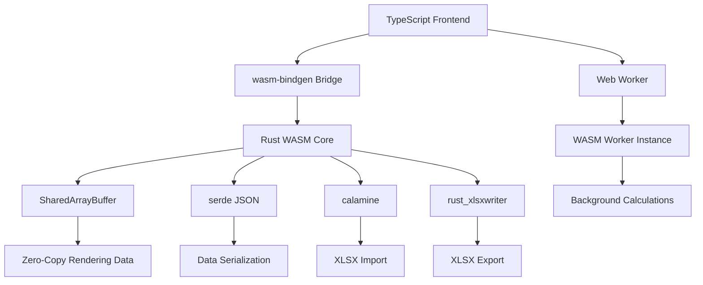

# WASM Integration Specification

## Overview

This specification covers the integration between Rust WASM modules and the TypeScript frontend, including memory management, serialization, Web Worker threading, and file import/export.

## Architecture



## wasm-bindgen Bridge

The bridge between TypeScript and Rust using wasm-bindgen.

### Rust Side

```rust
// rusheet-wasm/src/lib.rs

use wasm_bindgen::prelude::*;
use rusheet_core::{Sheet, CellData, CellValue};
use serde::{Serialize, Deserialize};

#[wasm_bindgen]
pub struct RuSheetEngine {
    sheets: Vec<Sheet>,
    active_sheet: usize,
}

#[wasm_bindgen]
impl RuSheetEngine {
    #[wasm_bindgen(constructor)]
    pub fn new() -> Self {
        // Set panic hook for better error messages
        #[cfg(feature = "console_error_panic_hook")]
        console_error_panic_hook::set_once();

        Self {
            sheets: vec![Sheet::new("Sheet1".to_string(), "sheet1".to_string())],
            active_sheet: 0,
        }
    }

    /// Get cell value as JSON string
    #[wasm_bindgen(js_name = getCellValue)]
    pub fn get_cell_value(&self, row: usize, col: usize) -> JsValue {
        if let Some(sheet) = self.sheets.get(self.active_sheet) {
            if let Some(cell) = sheet.get_cell(row, col) {
                return serde_wasm_bindgen::to_value(&cell.value).unwrap();
            }
        }

        JsValue::NULL
    }

    /// Set cell value
    #[wasm_bindgen(js_name = setCellValue)]
    pub fn set_cell_value(&mut self, row: usize, col: usize, value: &str) -> Result<(), JsValue> {
        if let Some(sheet) = self.sheets.get_mut(self.active_sheet) {
            sheet.set_cell_value(row, col, value);
            Ok(())
        } else {
            Err(JsValue::from_str("Invalid sheet index"))
        }
    }

    /// Get rendered cell data for viewport (batch operation)
    #[wasm_bindgen(js_name = getViewportData)]
    pub fn get_viewport_data(
        &self,
        start_row: usize,
        end_row: usize,
        start_col: usize,
        end_col: usize,
    ) -> JsValue {
        let mut cells = Vec::new();

        if let Some(sheet) = self.sheets.get(self.active_sheet) {
            for row in start_row..=end_row {
                for col in start_col..=end_col {
                    if let Some(cell) = sheet.get_cell(row, col) {
                        cells.push(RenderCell {
                            row,
                            col,
                            display_value: cell.display_value.clone(),
                            style: cell.style.clone(),
                        });
                    }
                }
            }
        }

        serde_wasm_bindgen::to_value(&cells).unwrap()
    }

    /// Batch set cell values (optimized)
    #[wasm_bindgen(js_name = setCellValuesBatch)]
    pub fn set_cell_values_batch(&mut self, updates: JsValue) -> Result<(), JsValue> {
        let updates: Vec<CellUpdate> = serde_wasm_bindgen::from_value(updates)
            .map_err(|e| JsValue::from_str(&format!("Deserialization error: {}", e)))?;

        if let Some(sheet) = self.sheets.get_mut(self.active_sheet) {
            for update in updates {
                sheet.set_cell_value(update.row, update.col, &update.value);
            }
            Ok(())
        } else {
            Err(JsValue::from_str("Invalid sheet index"))
        }
    }

    /// Evaluate all formulas
    #[wasm_bindgen(js_name = recalculate)]
    pub fn recalculate(&mut self) -> Result<(), JsValue> {
        if let Some(sheet) = self.sheets.get_mut(self.active_sheet) {
            sheet.recalculate_all()
                .map_err(|e| JsValue::from_str(&e))?;
        }

        Ok(())
    }

    /// Insert rows
    #[wasm_bindgen(js_name = insertRows)]
    pub fn insert_rows(&mut self, at: usize, count: usize) -> Result<(), JsValue> {
        if let Some(sheet) = self.sheets.get_mut(self.active_sheet) {
            sheet.insert_rows(at, count);
            Ok(())
        } else {
            Err(JsValue::from_str("Invalid sheet index"))
        }
    }

    /// Delete rows
    #[wasm_bindgen(js_name = deleteRows)]
    pub fn delete_rows(&mut self, at: usize, count: usize) -> Result<(), JsValue> {
        if let Some(sheet) = self.sheets.get_mut(self.active_sheet) {
            sheet.delete_rows(at, count);
            Ok(())
        } else {
            Err(JsValue::from_str("Invalid sheet index"))
        }
    }

    /// Export to JSON
    #[wasm_bindgen(js_name = exportToJson)]
    pub fn export_to_json(&self) -> JsValue {
        serde_wasm_bindgen::to_value(&self.sheets).unwrap()
    }

    /// Import from JSON
    #[wasm_bindgen(js_name = importFromJson)]
    pub fn import_from_json(&mut self, json: JsValue) -> Result<(), JsValue> {
        let sheets: Vec<Sheet> = serde_wasm_bindgen::from_value(json)
            .map_err(|e| JsValue::from_str(&format!("Import error: {}", e)))?;

        self.sheets = sheets;
        self.active_sheet = 0;

        Ok(())
    }
}

#[derive(Serialize, Deserialize)]
struct RenderCell {
    row: usize,
    col: usize,
    display_value: String,
    #[serde(skip_serializing_if = "Option::is_none")]
    style: Option<CellStyle>,
}

#[derive(Serialize, Deserialize)]
struct CellUpdate {
    row: usize,
    col: usize,
    value: String,
}
```

### TypeScript Side

```typescript
// frontend/src/wasm/engine.ts

import init, { RuSheetEngine } from 'rusheet-wasm';

export class WasmEngineWrapper {
  private engine: RuSheetEngine | null = null;
  private initialized: boolean = false;

  async initialize(): Promise<void> {
    if (this.initialized) return;

    await init();
    this.engine = new RuSheetEngine();
    this.initialized = true;
  }

  getCellValue(row: number, col: number): any {
    if (!this.engine) throw new Error('Engine not initialized');
    return this.engine.getCellValue(row, col);
  }

  setCellValue(row: number, col: number, value: string): void {
    if (!this.engine) throw new Error('Engine not initialized');
    this.engine.setCellValue(row, col, value);
  }

  getViewportData(
    startRow: number,
    endRow: number,
    startCol: number,
    endCol: number
  ): RenderCell[] {
    if (!this.engine) throw new Error('Engine not initialized');
    return this.engine.getViewportData(startRow, endRow, startCol, endCol);
  }

  setCellValuesBatch(updates: CellUpdate[]): void {
    if (!this.engine) throw new Error('Engine not initialized');
    this.engine.setCellValuesBatch(updates);
  }

  recalculate(): void {
    if (!this.engine) throw new Error('Engine not initialized');
    this.engine.recalculate();
  }

  insertRows(at: number, count: number): void {
    if (!this.engine) throw new Error('Engine not initialized');
    this.engine.insertRows(at, count);
  }

  deleteRows(at: number, count: number): void {
    if (!this.engine) throw new Error('Engine not initialized');
    this.engine.deleteRows(at, count);
  }

  exportToJson(): any {
    if (!this.engine) throw new Error('Engine not initialized');
    return this.engine.exportToJson();
  }

  importFromJson(data: any): void {
    if (!this.engine) throw new Error('Engine not initialized');
    this.engine.importFromJson(data);
  }
}

export interface RenderCell {
  row: number;
  col: number;
  displayValue: string;
  style?: CellStyle;
}

export interface CellUpdate {
  row: number;
  col: number;
  value: string;
}
```

## Shared Memory for Zero-Copy Rendering

Use SharedArrayBuffer for efficient data transfer without serialization.

```rust
// rusheet-wasm/src/shared_memory.rs

use wasm_bindgen::prelude::*;

#[wasm_bindgen]
pub struct SharedRenderBuffer {
    // Buffer layout:
    // [cell_count: u32][cell_0][cell_1]...[cell_n]
    // Each cell: [row: u32][col: u32][value_len: u32][value_bytes...][style_flags: u32]
    buffer: Vec<u8>,
}

#[wasm_bindgen]
impl SharedRenderBuffer {
    #[wasm_bindgen(constructor)]
    pub fn new(capacity: usize) -> Self {
        Self {
            buffer: Vec::with_capacity(capacity),
        }
    }

    /// Write render data to buffer
    pub fn write_cells(&mut self, cells: &[RenderCell]) {
        self.buffer.clear();

        // Write cell count
        self.buffer.extend_from_slice(&(cells.len() as u32).to_le_bytes());

        for cell in cells {
            // Write row and col
            self.buffer.extend_from_slice(&(cell.row as u32).to_le_bytes());
            self.buffer.extend_from_slice(&(cell.col as u32).to_le_bytes());

            // Write display value
            let value_bytes = cell.display_value.as_bytes();
            self.buffer.extend_from_slice(&(value_bytes.len() as u32).to_le_bytes());
            self.buffer.extend_from_slice(value_bytes);

            // Write style flags (simplified)
            let style_flags = 0u32; // TODO: Encode style
            self.buffer.extend_from_slice(&style_flags.to_le_bytes());
        }
    }

    /// Get pointer to buffer (for SharedArrayBuffer)
    pub fn as_ptr(&self) -> *const u8 {
        self.buffer.as_ptr()
    }

    pub fn len(&self) -> usize {
        self.buffer.len()
    }
}
```

```typescript
// frontend/src/wasm/shared-buffer.ts

export class SharedRenderBuffer {
  private buffer: SharedArrayBuffer;
  private view: DataView;

  constructor(size: number) {
    this.buffer = new SharedArrayBuffer(size);
    this.view = new DataView(this.buffer);
  }

  readCells(): RenderCell[] {
    const cells: RenderCell[] = [];
    let offset = 0;

    // Read cell count
    const cellCount = this.view.getUint32(offset, true);
    offset += 4;

    for (let i = 0; i < cellCount; i++) {
      // Read row and col
      const row = this.view.getUint32(offset, true);
      offset += 4;
      const col = this.view.getUint32(offset, true);
      offset += 4;

      // Read display value
      const valueLen = this.view.getUint32(offset, true);
      offset += 4;

      const valueBytes = new Uint8Array(this.buffer, offset, valueLen);
      const displayValue = new TextDecoder().decode(valueBytes);
      offset += valueLen;

      // Read style flags
      const styleFlags = this.view.getUint32(offset, true);
      offset += 4;

      cells.push({
        row,
        col,
        displayValue,
        style: this.decodeStyle(styleFlags),
      });
    }

    return cells;
  }

  private decodeStyle(flags: number): CellStyle | undefined {
    // TODO: Decode style from flags
    return undefined;
  }
}
```

## Web Worker Integration

Offload heavy computations to Web Workers.

```typescript
// frontend/src/workers/calculation-worker.ts

import init, { RuSheetEngine } from 'rusheet-wasm';

let engine: RuSheetEngine | null = null;

self.onmessage = async (e: MessageEvent) => {
  const { type, payload } = e.data;

  switch (type) {
    case 'init':
      await init();
      engine = new RuSheetEngine();
      self.postMessage({ type: 'init-complete' });
      break;

    case 'setCellValue':
      if (engine) {
        engine.setCellValue(payload.row, payload.col, payload.value);
        self.postMessage({ type: 'setCellValue-complete' });
      }
      break;

    case 'recalculate':
      if (engine) {
        const start = performance.now();
        engine.recalculate();
        const duration = performance.now() - start;

        self.postMessage({
          type: 'recalculate-complete',
          duration,
        });
      }
      break;

    case 'getViewportData':
      if (engine) {
        const data = engine.getViewportData(
          payload.startRow,
          payload.endRow,
          payload.startCol,
          payload.endCol
        );

        self.postMessage({
          type: 'viewport-data',
          data,
        });
      }
      break;

    case 'importFromJson':
      if (engine) {
        engine.importFromJson(payload.data);
        self.postMessage({ type: 'import-complete' });
      }
      break;

    default:
      console.warn('Unknown worker message type:', type);
  }
};
```

```typescript
// frontend/src/workers/worker-manager.ts

export class WorkerManager {
  private worker: Worker;
  private callbacks: Map<string, (data: any) => void> = new Map();

  constructor() {
    this.worker = new Worker(
      new URL('./calculation-worker.ts', import.meta.url),
      { type: 'module' }
    );

    this.worker.onmessage = (e: MessageEvent) => {
      const { type, ...rest } = e.data;
      const callback = this.callbacks.get(type);

      if (callback) {
        callback(rest);
        this.callbacks.delete(type);
      }
    };
  }

  async initialize(): Promise<void> {
    return new Promise((resolve) => {
      this.callbacks.set('init-complete', () => resolve());
      this.worker.postMessage({ type: 'init' });
    });
  }

  setCellValue(row: number, col: number, value: string): Promise<void> {
    return new Promise((resolve) => {
      this.callbacks.set('setCellValue-complete', () => resolve());
      this.worker.postMessage({
        type: 'setCellValue',
        payload: { row, col, value },
      });
    });
  }

  recalculate(): Promise<{ duration: number }> {
    return new Promise((resolve) => {
      this.callbacks.set('recalculate-complete', (data) => resolve(data));
      this.worker.postMessage({ type: 'recalculate' });
    });
  }

  getViewportData(
    startRow: number,
    endRow: number,
    startCol: number,
    endCol: number
  ): Promise<RenderCell[]> {
    return new Promise((resolve) => {
      this.callbacks.set('viewport-data', (data) => resolve(data.data));
      this.worker.postMessage({
        type: 'getViewportData',
        payload: { startRow, endRow, startCol, endCol },
      });
    });
  }

  importFromJson(data: any): Promise<void> {
    return new Promise((resolve) => {
      this.callbacks.set('import-complete', () => resolve());
      this.worker.postMessage({
        type: 'importFromJson',
        payload: { data },
      });
    });
  }

  terminate(): void {
    this.worker.terminate();
  }
}
```

## XLSX Import/Export

Using calamine for reading and rust_xlsxwriter for writing Excel files.

```rust
// rusheet-wasm/src/xlsx.rs

use wasm_bindgen::prelude::*;
use calamine::{Reader, Xlsx, open_workbook_from_rs};
use rust_xlsxwriter::{Workbook, Worksheet, Format};
use std::io::Cursor;

#[wasm_bindgen]
pub struct XlsxImporter;

#[wasm_bindgen]
impl XlsxImporter {
    /// Import XLSX from byte array
    #[wasm_bindgen(js_name = importXlsx)]
    pub fn import_xlsx(data: &[u8]) -> Result<JsValue, JsValue> {
        let cursor = Cursor::new(data);
        let mut workbook: Xlsx<_> = open_workbook_from_rs(cursor)
            .map_err(|e| JsValue::from_str(&format!("Failed to open workbook: {}", e)))?;

        let mut sheets = Vec::new();

        for sheet_name in workbook.sheet_names() {
            if let Some(Ok(range)) = workbook.worksheet_range(&sheet_name) {
                let mut cells = Vec::new();

                for (row_idx, row) in range.rows().enumerate() {
                    for (col_idx, cell) in row.iter().enumerate() {
                        let value = match cell {
                            calamine::DataType::Int(i) => i.to_string(),
                            calamine::DataType::Float(f) => f.to_string(),
                            calamine::DataType::String(s) => s.clone(),
                            calamine::DataType::Bool(b) => b.to_string(),
                            calamine::DataType::Error(e) => format!("#ERROR: {:?}", e),
                            calamine::DataType::Empty => continue,
                        };

                        cells.push(ImportedCell {
                            row: row_idx,
                            col: col_idx,
                            value,
                        });
                    }
                }

                sheets.push(ImportedSheet {
                    name: sheet_name.clone(),
                    cells,
                });
            }
        }

        serde_wasm_bindgen::to_value(&sheets)
            .map_err(|e| JsValue::from_str(&format!("Serialization error: {}", e)))
    }
}

#[derive(Serialize)]
struct ImportedSheet {
    name: String,
    cells: Vec<ImportedCell>,
}

#[derive(Serialize)]
struct ImportedCell {
    row: usize,
    col: usize,
    value: String,
}

#[wasm_bindgen]
pub struct XlsxExporter;

#[wasm_bindgen]
impl XlsxExporter {
    /// Export to XLSX byte array
    #[wasm_bindgen(js_name = exportXlsx)]
    pub fn export_xlsx(engine: &RuSheetEngine) -> Result<Vec<u8>, JsValue> {
        let mut workbook = Workbook::new();

        for (sheet_idx, sheet) in engine.sheets.iter().enumerate() {
            let worksheet = workbook.add_worksheet();
            worksheet.set_name(&sheet.name)
                .map_err(|e| JsValue::from_str(&format!("Failed to set sheet name: {}", e)))?;

            // Write cells
            for row in 0..sheet.row_count {
                for col in 0..sheet.col_count {
                    if let Some(cell) = sheet.get_cell(row, col) {
                        match &cell.value {
                            CellValue::Number(n) => {
                                worksheet.write_number(row as u32, col as u16, *n)
                                    .map_err(|e| JsValue::from_str(&format!("Write error: {}", e)))?;
                            }
                            CellValue::String(s) | CellValue::Formula(s) => {
                                worksheet.write_string(row as u32, col as u16, s)
                                    .map_err(|e| JsValue::from_str(&format!("Write error: {}", e)))?;
                            }
                            CellValue::Boolean(b) => {
                                worksheet.write_boolean(row as u32, col as u16, *b)
                                    .map_err(|e| JsValue::from_str(&format!("Write error: {}", e)))?;
                            }
                            _ => {}
                        }
                    }
                }
            }
        }

        let mut buffer = Vec::new();
        workbook.save_to_buffer(&mut buffer)
            .map_err(|e| JsValue::from_str(&format!("Failed to save workbook: {}", e)))?;

        Ok(buffer)
    }
}
```

```typescript
// frontend/src/import-export/xlsx.ts

import { XlsxImporter, XlsxExporter } from 'rusheet-wasm';

export class XlsxManager {
  async importFile(file: File): Promise<void> {
    const arrayBuffer = await file.arrayBuffer();
    const uint8Array = new Uint8Array(arrayBuffer);

    const sheets = XlsxImporter.importXlsx(uint8Array);

    // Process imported data
    console.log('Imported sheets:', sheets);

    return sheets;
  }

  async exportFile(engine: WasmEngineWrapper, filename: string): Promise<void> {
    const xlsxData = XlsxExporter.exportXlsx(engine);

    // Create blob and download
    const blob = new Blob([xlsxData], {
      type: 'application/vnd.openxmlformats-officedocument.spreadsheetml.sheet',
    });

    const url = URL.createObjectURL(blob);
    const a = document.createElement('a');
    a.href = url;
    a.download = filename;
    a.click();

    URL.revokeObjectURL(url);
  }
}
```

## Performance Optimization

### Object Pooling

```typescript
// frontend/src/utils/object-pool.ts

export class ObjectPool<T> {
  private pool: T[] = [];
  private factory: () => T;
  private reset: (obj: T) => void;

  constructor(factory: () => T, reset: (obj: T) => void, initialSize: number = 10) {
    this.factory = factory;
    this.reset = reset;

    for (let i = 0; i < initialSize; i++) {
      this.pool.push(factory());
    }
  }

  acquire(): T {
    if (this.pool.length > 0) {
      return this.pool.pop()!;
    }

    return this.factory();
  }

  release(obj: T): void {
    this.reset(obj);
    this.pool.push(obj);
  }

  clear(): void {
    this.pool = [];
  }
}

// Example usage for render cells
export const renderCellPool = new ObjectPool<RenderCell>(
  () => ({ row: 0, col: 0, displayValue: '', style: undefined }),
  (cell) => {
    cell.row = 0;
    cell.col = 0;
    cell.displayValue = '';
    cell.style = undefined;
  },
  1000
);
```

### String Interning

```rust
// rusheet-core/src/utils/string_intern.rs

use std::collections::HashMap;
use std::sync::Arc;

pub struct StringInterner {
    strings: HashMap<String, Arc<str>>,
}

impl StringInterner {
    pub fn new() -> Self {
        Self {
            strings: HashMap::new(),
        }
    }

    pub fn intern(&mut self, s: &str) -> Arc<str> {
        if let Some(interned) = self.strings.get(s) {
            interned.clone()
        } else {
            let arc: Arc<str> = Arc::from(s);
            self.strings.insert(s.to_string(), arc.clone());
            arc
        }
    }

    pub fn len(&self) -> usize {
        self.strings.len()
    }

    pub fn clear(&mut self) {
        self.strings.clear();
    }
}
```

## References

- [wasm-bindgen Documentation](https://rustwasm.github.io/wasm-bindgen/)
- [calamine - Excel reader](https://github.com/tafia/calamine)
- [rust_xlsxwriter - Excel writer](https://github.com/jmcnamara/rust_xlsxwriter)
- [SharedArrayBuffer - MDN](https://developer.mozilla.org/en-US/docs/Web/JavaScript/Reference/Global_Objects/SharedArrayBuffer)
- [Web Workers API](https://developer.mozilla.org/en-US/docs/Web/API/Web_Workers_API)
